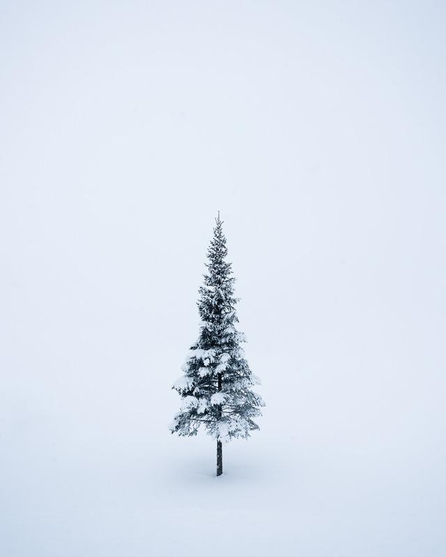

In this article, I talk about habits that, in my experience, boost creativity. Some of these habits I have learned from dozens of self-help books. Some are my own experiences from trials and errors in the past decade. I also tell you what my typical day looks like as a landscape photographer while I’m not on the road traveling. With further, ado, let's dive in.

## 1. Sleep

I think it's fundamental to start with one of the easiest to change and yet extremely powerful habits: sleep.

Sleep is essential for energy and creativity, and that's why I try to get at least seven to nine hours of sleep every night. I wake up between seven and eight a clock in the late autumn and winter. In the summer and spring, I wake up much earlier if I plan to go out for a morning shoot. I find it essential to have some structure in my daily life, and the sleep schedule is an excellent way to get some structure.

## 2. Routines

Building routines to spark inspiration and motivation towards your everyday life is key to being constant with your creativity.

My day usually begins as follows. I get out of bed, always with an intention to create something. I make the bed if my wife is getting up at the same time. I go to the bathroom and brush my teeth. The next thing I recently started doing is "body awakening" routine – a quick set of ten pushups, ten crunches, ten squats, and ten pullups. The method wakes me up if I feel tired. After I have woken up, I sit down to meditate for 10 to 20 minutes and sometimes longer. After meditation, I write one page to my journal to clear my head from ruminating thoughts. Typically the whole routine takes about 35 minutes, and as a reward, I go downstairs and drink a big glass of water and make a cup of decaf coffee. I drink it black, so I don't ruin my fast. I like the habit of grinding the coffee beans and making the coffee even though I don't get the caffeine high anymore. I used to drink a lot of coffee but never really felt more energized and only got the coffee jitter, so I decided to ditch caffeine almost entirely. Lastly, I check my Oura ring stats for the night and start my daily tasks.

## 3. Distraction-free time

If you want to be creative, it's crucial to have distraction-free time for yourself. Seeing constant notifications, getting distracted by other people, and multi-tasking can all have a significant impact on how creative and focused you are with your tasks.

I don't use social media or check emails first thing in the morning, and nowadays, I don't even feel the need to check my phone in the morning. I suggest that you stop using your phone or social media in the first hour when you wake up. Give it a try, at least. Going through social media is one of those habits that can make you feel sluggish and dull. Energy is a big part of creativity and creative work, so why leave it up to something other than yourself.

## 4. Plan and choose your main focus

In my experience, if you lack motivation and don't know where to start, focus on the main thing you want to be good at. Your main thing should always be the main thing where you spend most of your time.

There are usually three different options for how my day starts after the morning routines. I make the decision earlier in the week or the previous day to choose what to do. My first choice is always to go out for a shoot, but if the weather or timing is not right, my second choice is either write a blog post or ideas for photographs and trips. Writing has only been part of my morning routine for the past two weeks now, so I'm still learning how to do it most efficiently. The third choice is to edit photographs; I often do it when I have been shooting the day before. Of course, it's not like I always choose one thing to do each day. Instead, I go between writing, editing, and so on. My main job is photography, so I keep that as my most important thing every day.

## 5. Timing and rhythm

Figuring out when you are most creative is not easy, but it can benefit you tremendously throughout your life. Some people find it easy to do creative tasks first thing in the morning, and others are fine working late at night. Of course, creativity can hit you when the moment is right in the middle of the night, and you should always be open to creative thinking.

For me, the first couple of hours after I have woken up are fantastic for creative work such as writing, photography, and editing. If I'm not outside photographing, I go to my home office and start my workday. When I'm writing, I open an article I'm working on or an empty document and work through topics I would like to share with you guys and then write down my thoughts. It usually starts with an idea, but it can change, and I try to write until I feel inspired by the topic to write more. Like today, it took me some time to write an idea I was interested in, but I started with a lot of different subjects. After having a sense of what I wanted to share, it was much easier to start writing. I don't want to be over-critical about what I'm writing when I'm starting to write since it kills my creativity. The same is with photographs and editing. If I have an idea of how to take or edit a picture, I try to be open and release the self-criticizing thoughts. It's a self-awareness process. When I don't know what to write about or when I need a break, I go back and forth editing and writing; it seems to be an excellent way to get most out of my time.

If I'm heading out to shoot, I check the weather forecast the previous day and then figure out a place to visit. Sometimes I might go and drive around and see if there are any exciting sceneries, clouds or fog. For these types of shoots, I tend to have one or two good trips out of ten. So even though I spend time out photographing, it doesn't mean I get any good photographs. It's part of the process of being a fulltime photographer. I don't think it's necessary to get a fantastic picture each time, but it is something I want to have as a goal every time I head out. Having a decent plan for a shoot is a significant first step to maximize success for a shoot. You can check some of my tips for planning [here](https://www.mikkolagerstedt.com/blog/2018/4/25/how-to-keep-yourself-motivated).

Once I'm back home from photographing, I tend to have a break from everything photography related and catch up with my wife.

## 6. Improve your craft

Think of creative ways how you can get better at your craft. I have been stuck with this thinking that good photography is just a matter of how many times I go out. Which is not the only way to get better at photography. You need to learn from your experiences.

What I do instead of just scrolling IG after a shoot, I go through the photographs I took and jot down ideas for pictures or write my thoughts about the shoot. I try to answer a couple of questions. What went well? How could I have been better capturing the images? Even though a shoot might have been disappointing, I try to learn something out of it. I try to work this way every day, and I'm continually trying to find habits that give me more creativity and ways to improve my photography. Going out to photograph is just one step of being a photographer, and in my opinion, it's not enough, at least when you want to improve and strive for better photographs.

## 7. Traveling and planning

When you don't feel creative, try to switch things up. Plan a trip, for example.

There seems to be a fine line on how inspired and focused I am to edit my pictures. There are a lot of things that might get between me and my inspiration, but here are a few that I find easy to handle. If there are a bunch of new photographs to go through and edit, I feel inspired. However, if there are too many photos I haven't checked yet, I might lose some of my essential focus on a single photograph, and then I might find myself jumping too often between pictures. And when I'm uninspired and bored to look at my old photos and don't have any new ones, I try to go out and shoot more as soon as possible. Even planning for a shoot or trip will boost my inspiration towards photography. Having the right variety of photographs to edit is vital for creative editing.

## 8. Healthy habits and movement

If you want to stay creative for a long time, check your eating and moving habits. A 30-minute walk outside in the morning can have a tremendous impact on how you feel throughout your day.

Every day after I have spent time editing or writing, I go out for a walk with our dogs. I walk about 45 minutes to an hour. Either before the walk or after it, I eat my first meal of the day. Usually, something like this: three eggs, broccoli, broccoli sprouts, spinach, olive oil, and an avocado. I eat the veggies raw and cook the eggs with a gentle heat. I have done a lot of reading and self experimenting with healthy habits. What works for me is intermittent fasting for sixteen to eighteen hours, which gives me more energy in the morning, and eating nutritious food is the best way I feel energized in the long run. Ninety percent of the time, I follow healthy food choices, which is easy because I do enjoy what I eat daily. The other ten percent of the time, I permit myself to eat whatever I want.

When talking about health, movement is an essential part of being energized to create. Additionally, to the walks, I workout three to four times a week lifting weights. As off from today, I'm starting a new habit to stretch or do light yoga every day, probably right after I have done the morning routine.

## 9. Goals that inspire

Having goals that motivate you intrinsically is essential. Procrastination only comes if you are not motivated enough to do something.

In the evening, I tend to focus on editing and writing. I have breaks ever so often to keep my focus. I usually don't try to keep my attention more than 45 minutes and then take a short break. If I lack focus as I often do, I try to have goals that inspire and motivate me. Whenever I feel tired, I keep my tasks and goals in front of me, and that way, I can remind myself why I do the tasks in the first place. Whether I do it because I want to share the beauty of photography with others or if I want to share something that might help someone.

## 10. Break the routines

Even if the structure is sound. In my opinion, it's crucial to occasionally have a break from your habits and energize and give yourself a rest day.

I don't follow my habits blindly. I make a deliberate decision to have days without the "normal" routine. I feel energized to create and follow through the routine in the following days to come.

When I'm traveling, and the sole purpose is to take photographs, I focus strictly on capturing the images. Depending, of course, how long the trip is. I don't often edit my pictures until I'm back at home. I have found that this way, I'm more creative. While I'm traveling, I do backups daily, and if I can't wait to edit a picture, I might give it go on the road.

**Additional habits you might want to try out that have had a massive impact not just on my creativity but overall well being:**

* Meditation – You can feel refreshed and creative after short meditation practice.
* Journaling – It's a great way to find your creativity by journaling what's on your mind.
* Deadlines – When you are desperate for creativity, have a deadline that inspires you to create. Make it public so you don't want to miss it.
* Reading – There is so much you can learn by reading, and with fictional books, your mind can wander and create unique worlds.

What creative habits do you have that inspire you to create more? Let me know if you found this article useful by any means. I would love to get your feedback!

## GET THE LATEST CONTENT FIRST

If you like this post. Subscribe to be the first to receive fresh new tutorials straight to your inbox!

Email Address

Subscribe

We respect your privacy.

Thank you!

View fullsize

One – Senja, Norway - 2016