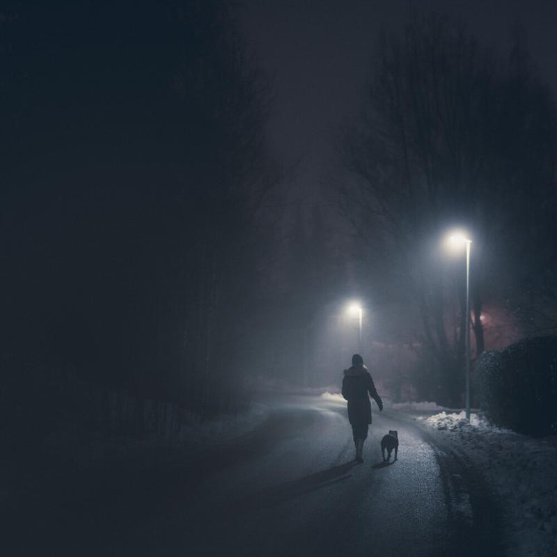

It's that time of the year once again. I have included my favorite photographs from the past year. It has been a great journey in photography and I have learned a lot about myself and my photography.

In 2014 I was lucky to be published on the [Telegraph](http://www.telegraph.co.uk/travel/destinations/europe/finland/11148911/Night-II-nocturnal-photography-from-Finland-by-Mikko-Lagerstedt.html), [Daily Mail](http://www.dailymail.co.uk/travel/travel_news/article-2855838/Frozen-beauty-Self-taught-photographer-captures-mesmerising-images-Finland-s-starry-skies-landscapes-blanketed-snow.html) and [Twisted Sifters](http://twistedsifter.com/2014/10/finland-night-photography-by-mikko-lagerstedt/) to mention few. I have just reached 500 000 followers on [Facebook](https://www.facebook.com/pages/Photography-Mikko-Lagerstedt/137616549627247?ref=nf). The year has been one of the most rewarding ones since I first started in 2009. This year I have captured some of my favorite images and seems that I have been drawn into night photography more than ever. It's interesting to see how my work looks after 2015.

What would you want to capture next year? One of my goals is to go and travel more around Finland, Norway, Iceland and more! Sky is the limit, literally!

I hope you enjoy my favorite photographs from 2014.

Have a fantastic New Year!

View fullsize

Mikko Lagerstedt - Divided - 2014, Meri-Pori, Finland

View fullsize

Mikko Lagerstedt - Highway - 2014, Finland

Mikko Lagerstedt - Pathway - 2014, Tuusula, Finland

View fullsize

Mikko Lagerstedt - Take Me Away - 2014, Yyteri, Finland

View fullsize

Mikko Lagerstedt - Beach At Night - 2014, Yyteri, Finland

View fullsize

Mikko Lagerstedt - First Row - 2014, Yyteri, Finland

View fullsize

Mikko Lagerstedt - In The Silence - 2014, Kerava, Finland

View fullsize

Mikko Lagerstedt - Path - 2014, Kerava, Finland

View fullsize

Mikko Lagerstedt - Frozen Echo - 2014, Porvoo, Finland

View fullsize

Mikko Lagerstedt - Everlasting Moment - 2014, Meri-Pori, Finland

View fullsize

Mikko Lagerstedt - Silent Elegance - 2014, Porvoo, Finland

View fullsize

Mikko Lagerstedt - Night Walk - 2014, Kerava, Finland

In 2015 I will publish a "Night Photography Masterclass" ebook. 

UPDATE: And the winner of the [Print Collection](/print-collections) is Michael P. Thank you all for participating in the print giveaway!