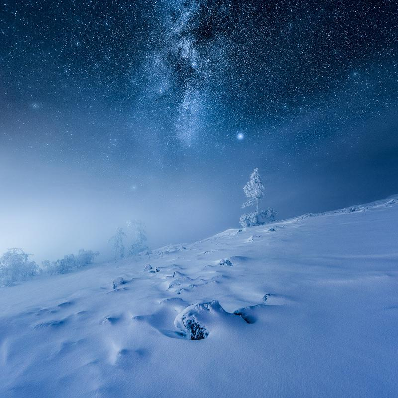

Happy New Year everyone! A year has gone by and what a year it has been. I feel grateful that I can continue to do what I love! Thank you all for the support! As always I have gathered my favorite pictures from the previous year.

[The Compete Photograph Collection](/complete-collection)

View fullsize

Mikko Lagerstedt - Glow - 2015 - Lempäälä, Finland

View fullsize

Mikko Lagerstedt - Searching For The Horizon - 2015 - Meri-Pori, Finland

View fullsize

Mikko Lagerstedt - The Whole Universe Surrenders - 2015 - Emäsalo, Finland

View fullsize

Mikko Lagerstedt - Pier - 2015 - Cyprus

View fullsize

Mikko Lagerstedt - Illuminated Night - 2015 - Porvoo, Finland

View fullsize

Mikko Lagerstedt - The Lost World - 2015 (published) - Emäsalo, Finland

View fullsize

Mikko Lagerstedt - Stillness of Night - 2015 - Emäsalo, Finland

View fullsize

Mikko Lagerstedt - Frozen Wrodl - 2015 - Ylläs, Finland

Thank you for viewing! If you are interested in prints, go ahead to my print shop: <http://www.mikkolagerstedt.com/buy-art>.