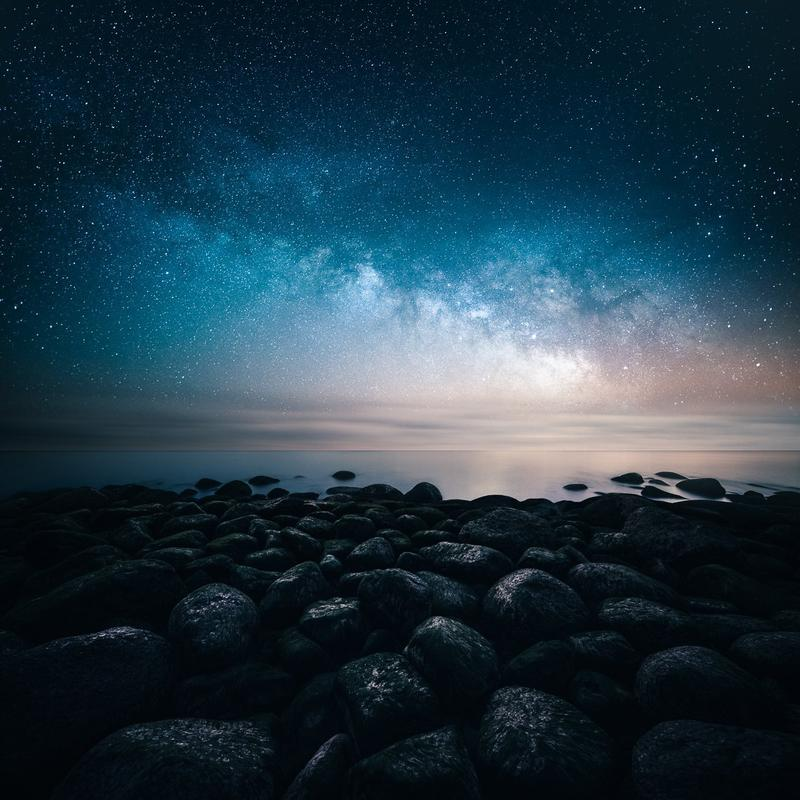

Do you want to capture the night sky with a beautiful and interesting landscape? In this tutorial, I'll teach you my process in astrophotography, from gear to capturing the photographs.

Whether you are new to astrophotography or an experienced nighttime shooter, I think you can learn a few tricks from this article.

## 1. What gear to use for astrophotography?

If you desire to capture the same kind of astrophotography as I do, you don't need a tracker or shoot stacked photos of the night sky. We will go through the dual exposure technique, but I try to keep the whole process simple. At the moment, I can't carry a lot of equipment because of my back surgery anyway.

**Essential gear for astrophotography**

* A camera that can handle high ISO settings with low noise
* Wide-angle lens for full-frame 14 mm to 24 mm, crop sensor 10 mm to 18 mm with an aperture between 1.4 and 2.8
* Tripod

**What I use in 2021**

* [Nikon Z 7](https://amzn.to/3mnzYbm)
* [Nikon 14-24 mm f/2.8](https://amzn.to/3pMJcA5)
* [Sigma 20 mm f/1.4](https://amzn.to/31cFZzD)
* [RRS Tripod](https://www.amazon.com/gp/product/B07MXNBGGG/ref=as_li_qf_asin_il_tl?ie=UTF8&tag=photomikkolag-20&creative=9325&linkCode=as2&creativeASIN=B07MXNBGGG&linkId=564cdfc5f0ab100fd77855d9006e955e) & [RRS Head](https://amzn.to/31eoQFJ)

*I'm an Amazon affiliate. I get a small affiliate fee if you click the link and use it to make a purchase. Thank you!*

## 2. Planning for astrophotography

It's possible to just head out at night and wish for the best. Sometimes it can work, but astrophotography is a lot about planning.

I usually start my planning with the moon phase. It's the timing of when the moon is visible and at what time. [View the moon phase.](https://moon.nasa.gov/moon-in-motion/moon-phases/)

After you know what dates are best for the photograph you want to capture, you should check the weather forecast to have a clear sky.

Timing is also essential for astrophotography, and it can be a bit tricky if you want to capture the core of the Milky Way. From March to September in the Northern Hemisphere and September to March in the Southern Hemisphere, you will get the most impressive view of the Milky Way. It's because the earth spins around on its axis and how the angle changes in different seasons.

Before selecting a place for your shoot, check out a light pollution map and find a place with less light pollution. I recommend leaving a city or at least shooting the night sky outwards from the city.

Use tools like [PhotoPills](https://www.photopills.com/) or [TPE](https://photoephemeris.com/) for location scouting and to figure out where the Milky Way is in the night sky. In the Northern Hemisphere, look towards the southern skies to see the galactic core. The core will start to be visible due southeast (Spring), due south (Summer), or southwest (Fall). In the Southern Hemisphere, look towards the south of skies to see the galactic core. In this case, the center will start to be visible due southwest (Spring) or southeast (Fall and Winter).

**Planning checklist for astrophotography**

* [Moon phase](https://moon.nasa.gov/moon-in-motion/moon-phases/)
* [Weather forecast](https://www.yr.no/en/)
* Timing for the [Milky Way](https://www.photopills.com/articles/how-plan-milky-way-using-augmented-reality) & night sky events
* [Light pollution map](https://www.lightpollutionmap.info/)
* Location scouting with [Google Maps](https://www.google.com/maps), [PhotoPills](https://www.photopills.com/), and [TPE](https://photoephemeris.com/)

Cold Shower – ISO 6400, 15 mm, f/2.8 & 30 sec.

## 3. Capturing The Astrophotographs

When you have done your planning thoroughly, you can now enjoy the best part: taking photographs. However, if you struggle to get sharp stars in your photos, practice the infinity focus point on your lens. You can do this when it's still bright outside or use a bright light in the distance to focus the lens using autofocus or manually with the viewfinder. When you see the stars or far away objects as small & sharp as you can get, the lens is focused on infinity. Take note of the focus point on your lens and see if you can find it manually. This process makes it much easier to shoot the stars later.

Use the rule of 500 for your camera settings. Your shutter speed equals 500 ÷ equivalent focal length so, if your full-frame equivalent focal length is 20mm, the rule of 500 means that you use a shutter speed of 500 ÷ 20 = 25 seconds.

The most common settings I use are ISO 3200–8000, 20–30 seconds exposure, aperture 1.4–2.8.

When you are ready at your planned location, take a moment and search for compositions and foreground elements that are interesting to you.

Use the Milky Way as a compass, so it complements the foreground elements. It's easier to find a composition if the goal is to have the Milky Way work with the framing.

When you find a shot that you enjoy, take the first shot and see if you can improve it by moving your camera.

Remember that you should try to expose the photograph to the right side of the histogram, which helps you achieve more information in the shadows and less grain.

More detail on the right side of the histogram,   
makes a good exposure for night photographs.

**Capturing checklist for astrophotography**

* Use best settings for your camera and lens (rule of 500).
* Always check the focus by reviewing the photograph.
* Make the composition a priority.
* Expose to the right; this means you have to expose the image enough so that you don't have to pull up the shadows in editing.

Divided – Dual exposure technique with a 14 mm f/2.8 lens.

## 4. The Dual Exposure Technique ([Vision of Depth](https://www.mikkolagerstedt.com/star-photography-tutorial)) for Astrophotography

Now you know the essentials of capturing astrophotography, so let's take the whole thing to another level. I have used this technique to capture some of my favorite star photographs for the past ten years. It's simple two exposure shot combined later in post-processing.

The key here is to capture as much detail as possible in the landscape. Take the star photograph first with the settings I listed above and then crank up the exposure (up to 1-10 minutes) to capture more light in the landscape. If your camera doesn't support a longer than 30 seconds exposure, you must use a remote controller.

If your composition needs more "air," use two vertical images to capture the scenery. After capturing the night sky upwards, tilt the camera downwards, so the horizon is barely visible in the frame.

When the foreground elements are close, you need to use a smaller aperture and adjust the focus, so the foreground is sharp. As you go through the photos you have taken, try to visualize the outcome and see you need to capture the scenery differently. Patience is the key here.

**Dual exposure checklist**

* Capture the sky first.
* Use prolonged exposure to capture more light in the landscape (1-10 mins).
* Use two vertical shots if you need more space in the composition.
* Adjust the focus if the foreground elements are not sharp enough.
* Use a smaller aperture if you need more depth of field for your shot.

Lost in the Night – Dual exposure technique with a 20 mm 1.4 lens

Alright, that's it for this week's tutorial. I hope you enjoy it and learn something new! If you want to learn more of my techniques, check out my ebook [**Star Photography Masterclass**](https://www.mikkolagerstedt.com/star-photography-tutorial) where I go into more detail about all of these steps!

**Do you enjoy astrophotography? Would you like to see an astrophotography editing tutorial? Let me know in the comments!**

Until next time my fellow photographers, take care and keep on creating!

## Subscribe

If you enjoy this post. **Subscribe** to be the first to receive   
**fresh new tutorials** straight to your inbox!

First Name

Last Name

Email Address

Subscribe

We respect your privacy.

Thank you!