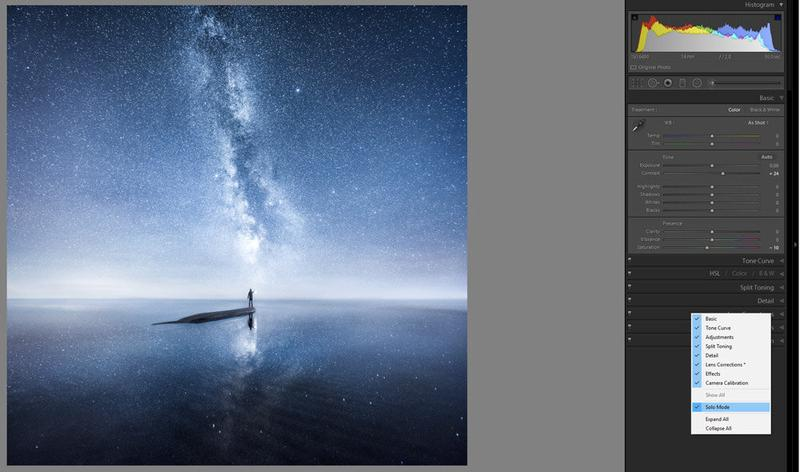

In this tutorial, I show you how you can set up your Lightroom to optimize and quicken your workflow. I hope you enjoy the tutorial.

### 1. Use Collections and Smart Collections instead of Folders

Creating a collection based catalog is the first thing I recommend to everyone who is starting to use Lightroom. It's a crucial step to keep your photographs neatly organized. Here is my organizing tutorial: [How To Organize Photos in Lightroom Using Smart Collections](http://www.mikkolagerstedt.com/blog/2014/1/8/lightroom-tutorial-organizing-photos-using-smart-collections).

Use Collections and Smart Collections

### 2. The most useful Lightroom shortcuts for Photographers

If you don't want to get overwhelmed by the amount of shortcut keys in Lightroom, I have listed below my favorite shortcuts that ease my workflow a lot! You can find all of the shortcuts used in Lightroom from Adobes website: [here](https://helpx.adobe.com/lightroom/help/keyboard-shortcuts.html).

CTRL/CMD + SHIFT + I = Opens Import Window  
F = Full-Screen View  
G = Grid view in Library  
E = Loupe mode in Library  
I = Loop photograph information overlay  
D = Develop Module

**In Develop Module:**  
R = Crop  
. / , = Cycle Basic Panel adjustments  
Enter = Close and Deactivate Current Tool   
M = Graduated Filter  
SHIFT + M = Radial Filter  
K = Adjustment Brush  
O = Overlay Mask  
Q = Spot Removal -tool  
Y = Split, Before, and After  
CTRL/CMD + E = Edit photograph in External Edit Program (Photoshop)  
CTRL/CMD + SHIFT + E = Export Image

### 3. Adjustment Tools

You could say that the most powerful tools in Lightroom are the adjustment tools.

Use Graduated Filter and Radial Filter to balance the photograph and add a focal point. I have explained how I use the graduated filter in my earlier tutorial: [How to Use Graduated And Radial Filters](http://www.mikkolagerstedt.com/blog/2014/5/11/how-to-use-lightroom-graduated-filters-radial-filters).

When you need a specific area to work on, use the Adjustment Brush.

View fullsize

Show the overlay of the mask with by shortcut: O.

### 4. How to set up Lightroom

You can go through the Settings on Mac from Lightroom -> Preferences and on Windows go to Edit -> Preferences.

* Uncheck: Show Splash Screen // This disables the starting screen when opening up Lightroom
* External Editing: TIFF, 16 bit, and ProPhoto // For the best quality editing in Photoshop, use these settings
* Check the Stack With Original // Helps you to keep your edits next to the original raw files
* File handling -> Camera Raw Cache: 50 GB // This is extremely important if your catalog is huge like mine. Use settings 20-50 GB on a hard disk that has the same amount or more space
* General -> Catalog settings -> General -> Select Backup LR-catalog Weekly // I find it often enough to backup my catalog once a week. Remember that this doesn't backup your actual pictures, just the catalog.
* Catalog settings -> Metadata -> Editing -> Check Automatically write changes into XMP // This helps you if your catalog doesn't work or if you need to import the photographs again. It makes sure you have the settings.

View fullsize

For faster Lightroom set a bigger cache size up to 50 GB should make it

### 5. Configure the workspace

Go to Develop Module and right-click on any of the adjustment panels and select Solo Mode. It makes your workflow quicker when you click on any of the panels Lightroom will automatically close the other panels. You can do this also for the left side panels if you don't want all of them open at the same time.

When you are working on a laptop or small screen it's important to know that you can edit the width of the side panels when hovering with your mouse on top of the border of the side panel. You can also hide the panels with shortcut TAB. When working with a singular photo you can set the bottom view to auto hide & show when you are not scrolling the images.

View fullsize

Use the Solo Mode to make your workflow faster and simpler