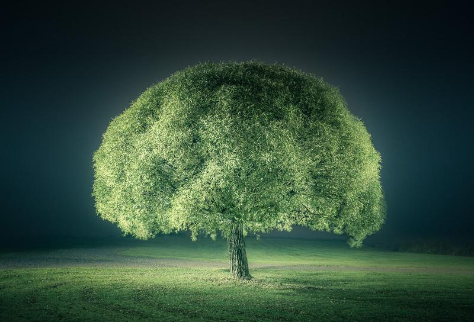

I have similar shot to this from my early days, but somehow I liked how this looks.   
I shot this last October on a beautiful foggy evening.

Nikon D800, Nikon 16 - 35 mm f/4.0 VR, Sirui Tripod R-4203L & Sirui Ball Head K-40X

ISO 100, 35 mm, f/4.0, 30 sec.

View fullsize

I processed this shot with my Fog Preset & Split Toning Preset. [More info about the presets here.](/presets)

Enjoy your weekend! :)