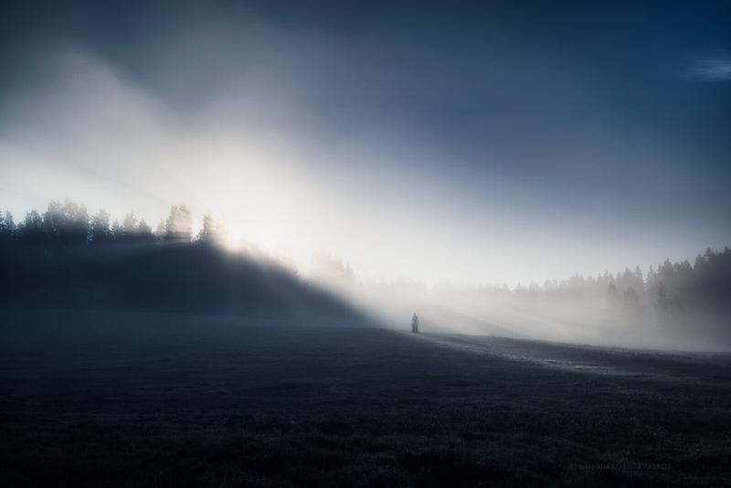

While going through some of my photographs from last year, I came across with this one. A shot on a beautiful misty Summer morning, taken about a year ago. As the sun was rising I had my camera on my tripod and used my remote controller to trigger the camera.

**Equipment**

Nikon D800, Nikon 16 - 35 mm f/4.0 VR, Sirui R4203-L tripod & Hähnel Giga T Pro II remote controller.

**Exif**  
ISO 100, f/5.6, 35 mm, 1/1600 sec.

**Post-processing**

Lightroom for color temperature, contrast and saturation. I also used one of my [presets](/presets) to base edit the photo: Morning Blues.

More info about the tools I use, can be found in the [FAQ-page](/faq).

Want a print of this photo? You can find it here: [Alone in the Light](http://www.redbubble.com/people/mikkolagerstedt/works/12255889-alone-in-the-light)

View fullsize

Alone in the Light - Mikko Lagerstedt - 2014