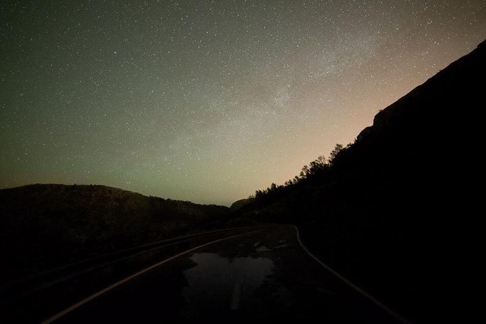

A night to remember in Mallorca, Spain. I was driving around the beautiful mountain roads Mallorca has to offer. It was a rainy evening, but I decided to go out anyway. As the clouds started to disappear behind the mountains I stopped the car and wanted to capture this view of road reflections of the water and Milky Way barely visible in behind the mountains in the horizon. This photograph was captured somewhere between Andratx and Lluc. I also included a before photo for you to view.

### Equipment & Exif

Nikon D800, Samyang 14 mm f/2.8, Sirui R-4203L tripod & K-40X  
ISO 6400, f/2.8, 30 sec. @ 14 mm

### Post-Processing

Samyang Lens Profile for Nikon D700 found with Adobe Lens Profile Downloader ([here](http://www.adobe.com/support/downloads/product.jsp?product=192&platform=Windows))  
  
I edited the image in Lightroom with [Phase Presets Collection](/phase-presets) for the color and overall clarity and detail. If you have the Phase Presets Collection you can follow these steps:

1. Lens profile correction
2. Temperature: 3200 & Tint +22 (might vary depending on your image)
3. Phase Preset: Night Subtle Detail
4. Phase Overall Settings: Stars Contrasty
5. Phase Effects: Vignette - Light
6. Phase Graduated Filters: Stars - Foreground Noise Reduction & Clarity
7. Final Adjustment: Noise Reduction - High ISO Med
8. Export: Check my [Night Photography Tutorial](http://www.mikkolagerstedt.com/blog/2013/11/8/night-photography-tutorial-lightroom-5-photoshop) for more information about my export settings.

If you are interested in the Phase Collection, now on sale for limited time. You can find more information about the presets [here](/phase-presets).

View fullsize

Apart - Mikko Lagerstedt, 2015, Mallorca

Apart - Before Lightroom Edit - See above