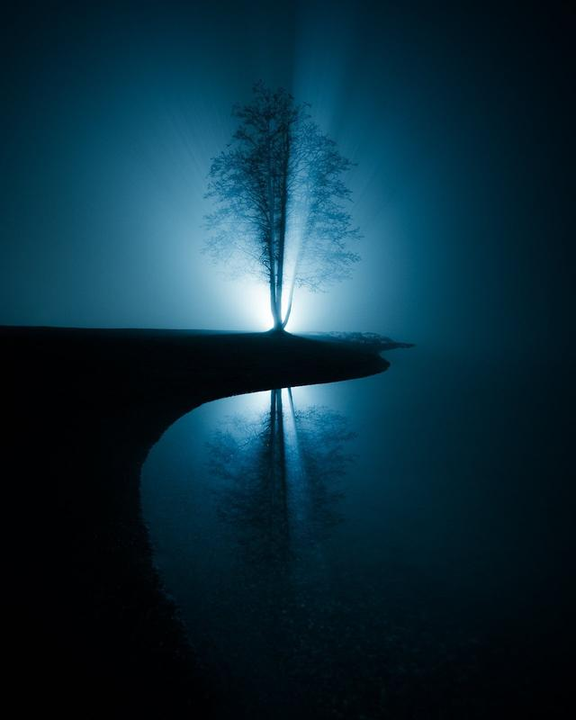

My favorite thing about photography is that you don't always have to travel far to capture unique photographs. In this week’s tutorial, I talk about capturing fog in winter and how it can add a sense of mystery and atmosphere to your photos. This is the ultimate guide to capturing winter fog photographs.

Whether a thin layer of mist hovering over a frozen lake or a thick fog enveloping a forest, fog can transform a mundane scene into something magical. In this tutorial, I show you how to capture stunning winter landscapes with mist, from finding the right location to choosing the right time of day and experimenting with compositions.

## Find the right location

Fog can be elusive, so it's essential to find a place where it is likely to appear. Look for areas with low-lying valleys, rivers, or lakes. These areas are more prone to fog because the cool air tends to sink and settle in these areas. Look for locations where the fog is likely to accumulate, such as near water, valleys, or low-lying areas.

1. Look for forecasts of foggy conditions, especially in the early morning or late evening when the air is cooler, and the humidity is higher. You can also check the humidity and dew point, as the fog is more likely to form when the air is saturated with moisture.
2. Pay attention to the wind direction. Fog is more likely to form in areas with calm winds. Look for locations where the wind is calm or where the wind is blowing away from the area you want to photograph.
3. Look for locations with interesting features that can add depth and interest to your photos, such as trees, buildings, or other landmarks. Consider using these elements to create leading lines or to add a sense of scale to your photos.
4. Fog can be unpredictable, so it's a good idea to visit your location at different times to see if the fog appears. This will also give you the opportunity to experiment with different lighting conditions and compositions.
5. The seaside can be an excellent place to capture fog in the Winter. The warm seawater and temperature drop can create a massive cloudlike fog.

Mikko Lagerstedt – Lost – Inkoo Finland 2022

## Choose the right time of day

Fog is most likely to appear in the early morning or late evening when the air is cooler and the humidity is higher. These times of day can also provide beautiful, soft light for photography. The early morning and late evening can be great for capturing beautiful, soft, light, and vibrant colors. The golden hour, just after sunrise, can be especially beautiful for foggy landscapes, as the warm, golden light can create a warm, ethereal atmosphere.

Mikko Lagerstedt – Solitude – Kilpisjärvi Finland 2018

### Use a tripod

Fog can be especially challenging to photograph because it moves and changes constantly. Using a tripod can help you get sharp, blur-free photos, even in low-light conditions.

### Experiment with white balance

Fog can give off a cool blue cast in photos, which may not be the look you want. Experiment with different white balance settings to warm up the colors or to maintain the cool tones. Alternatively, you can adjust the white balance post-processing when using RAW files. Some cameras have a "fog" or "cloudy" white balance setting that can be useful for foggy scenes.

### Use a polarizing filter

A polarizing filter can help reduce glare and enhance the contrast and saturation of the colors in your photos. A polarizing filter blocks specific wavelengths of light, which can help reduce reflections and make colors appear more vibrant. It can be particularly useful for landscape photography to make the sky and clouds appear more dramatic.

Mikko Lagerstedt – In The Mist – Järvenpää Finland 2022

## Play with compositions

Fog can add a sense of mystery and atmosphere to your photos. Experiment with different compositions to find the best shot. Consider using leading lines, such as a path or a river, to draw the viewer's eye into the photo. You can also try using the rule of thirds or leading lines to create a sense of depth in your photos.

1. Leading lines, such as a path or a river, can be a powerful tool to draw the viewer's eye into the photo and create a sense of depth and movement. Look for natural lines in the scene, such as a road or a stream, and use them to guide the viewer's eye through the photo. Leading lines can also be used to create a sense of depth in your photos. Look for lines that lead the viewer's eye into the distance, such as a road or a fence. This can help create a sense of perspective and make the photo more immersive.
2. The rule of thirds is a compositional principle that suggests that an image can be divided into nine equal parts by two equally-spaced horizontal lines and two equally-spaced vertical lines. The idea is to place the subject of the photo along these lines or at their intersections, creating a sense of balance and interest in the photo.
3. Experiment with different compositions. Don't be afraid to experiment with different compositions to find the best shot. Try different angles and perspectives, and get creative.

Mikko Lagerstedt – Winter Solitude – Järvenpää Finland 2021

### Use a low ISO

Try to use a low ISO setting to avoid noise in your photos. It will allow you to capture crisp, clear images even in low-light conditions. A high ISO can cause your photos to appear grainy or noisy, which can be especially noticeable when you start to work with your RAW files in Lightroom.

### Take your time

Fog can be a fleeting and elusive subject, so take your time to find the right composition and lighting. Don't be afraid to spend a little extra time setting up your shot to get the perfect image. Use a remote controller or a self-timer to avoid camera shake, and take multiple shots from different angles to give yourself more options when editing your photos.

Mikko Lagerstedt – Disappearance – Tuusula Finland 2022

## Editing Winter Fog Photography in Lightroom

How to creatively edit your winter fog photographs in Lightroom? Of course, the best way is using [**The EPIC Preset Collection**](/epic-presets), but you probably know it already! Why? Because it’s easy to use, and there are over 60 presets created for fog photographs!

Editing your winter fog photographs in Lightroom can be a great way to enhance the mood and atmosphere of your photos and bring out the best in your shots. Here are a few tips to get you started editing winter fog photography in Lightroom.

1. Start with the Basic adjustments, go through each slider from Exposure to Dehaze, and find your preferred adjustments. Be careful not to overdo contrast or dehaze, as too much contrast can make the photo look harsh and unrealistic.
2. Use the HSL panel to adjust specific colors. This can be a great way to add a creative touch to your photos and highlight certain colors or tones. For example, you can increase the saturation of the blue tones in your photo to enhance the foggy atmosphere, or you can increase the luminance of the green tones to make the trees stand out.
3. Masking and the Graduated Filter tool in Lightroom allow you to add a graduated effect to your photos, such as a gradient of color or a vignette. This can be a great way to draw the viewer's attention to a specific part of the photo or to add a creative touch. For example, you can use the Graduated Filter tool to add a gradient of blue to the sky to enhance the foggy atmosphere, or you can add a vignette to draw the viewer's attention to the center of the photo.
4. The Brush tool in Lightroom allows you to selectively edit specific areas of your photo. This can be a great way to add a creative touch to your photos and highlight specific details or colors. For example, you can use the Brush tool to selectively increase the contrast in the trees to make them stand out, or you can use it to selectively decrease the saturation of the sky to add a moody atmosphere.
5. The Split Toning panel in Lightroom allows you to add a split toning effect to your photo, where different colors are applied to the highlights and shadows. This can be a great way to add a creative touch to your photos and highlight specific colors or tones. For example, you can use the Split Toning panel to add a warm tone to the highlights and a cool tone to the shadows to create a moody atmosphere, or you can use it to add a blue tone to the highlights and a yellow tone to the shadows to create a surreal effect.
6. Add noise. You can easily add noise from the effects panel, making those possible gradients less likely to cause banding.

Mikko Lagerstedt – Into the Unknown – Tuusula Finland 2022

By using these creative editing techniques in Lightroom, you can add a unique and artistic touch to your winter fog photographs and showcase the unique and atmospheric beauty of the season.

For more winter knowledge, see my tutorial: [Winter photography – How to photograph in difficult Weather](https://www.mikkolagerstedt.com/blog/winter-photography-how-to-photograph-in-difficult-weather).

**Let me know what you think of the tutorial or if you have any additions! Thank you for reading.**

**I hope you have a wonderful holiday season!**

## [THE EPIC PRESET COLLECTION](/epic-presets)

[TAKE YOUR IMAGES TO THE NEXT LEVEL](/epic-presets)

## Subscribe

If you enjoy this post, SUBSCRIBE to be the first to receive **fresh new tutorials** straight to your inbox!

First Name

Last Name

Email Address

Subscribe

We respect your privacy.

Thank you!