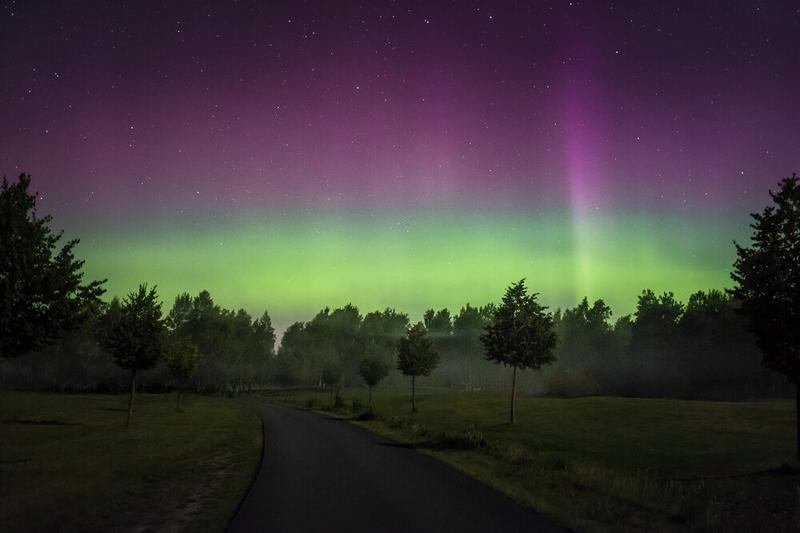

I had the chance to witness these beautiful lights of Aurora Borealis on one Summer night in Hanko, Finland. Usually we don't see these many times in the Southern part of Finland, but this time I got lucky.

**Equipment:**  
Nikon D800, Nikon 16 - 35 mm f/4.0 VR  
35 mm, f/4.0, ISO 6400 and 10 sec.

**Technique & Software:**  
Manual focusing to infinity on the lens, and because of the strong changes in the Northern Lights, I had to use quite short exposure time to get those beautiful spikes like in the photo in the right side. I used Lightroom 5 to add some contrast and reduce the noise slightly.

View fullsize

