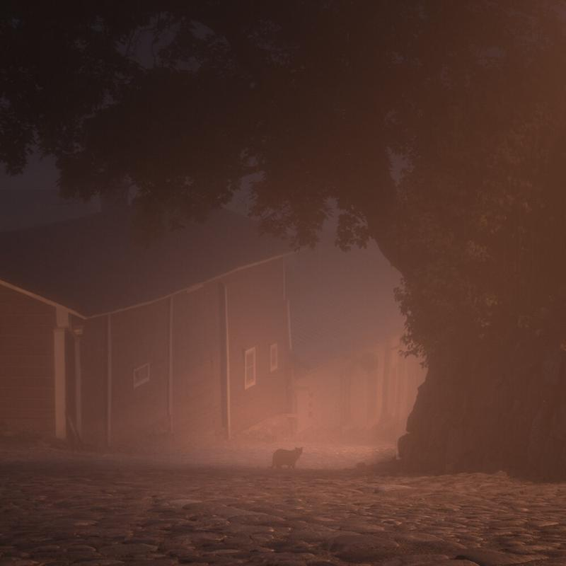

Hello everyone, I'm really honored to announce that my series Alone won the 3rd place in International Photography Awards ([link](http://www.photoawards.com/en/Pages/Gallery/winner2013sub.php?cat=People&level=student)).

I also got three Honorable Mentions from two of my series and one image. I'm really excited to have been chosen from the numerous entries they had this year.

In addition below you can see two detail pictures from my series Night Animals.

View fullsize

View fullsize

The series was quite successful and spread all around the internet ([this is colossal](http://www.thisiscolossal.com/2013/09/night-animals-mikko-lagerstedt/), [fubiz](http://www.fubiz.net/en/2013/09/13/night-animals-series/) etc.). I'm really happy to see this happen, it was fun and different project for me. :)