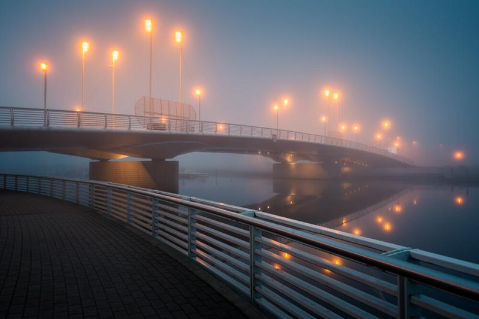

Hey everyone and Happy New Year!

I thought I would give you insight on how I go through processing images taken in foggy situations. Here is a shot I took in Porvoo, Finland on one summer morning, just before the sunrise.

**Gear:** Nikon D800, Nikon 16-35 mm f/4.0 VR, Sirui Tripod R-4203L + Sirui Ball Head K-40X

**Exif:** ISO 100, 26 mm, f/4.0, 0,4 sec.

View fullsize

Fog Bridge - Before - ISO 100, 26 mm, f/4.0 & 0,4 sec

### 1. Lens Correction

First thing I do is correct the possible distortion of the lens and chromatic aberration. I also tend to try the Lightroom 5 Upright option for this type of images. The Auto setting worked great for this image so I checked it. For this image the Basic adjustments were enough, so I left the Manual settings intact.

Fog Bridge - Apply the Lens Correction and Upright

### 2. Cropping & Straightening

I always do the cropping before I do anything else to the image. I find it the most distracting thing to leave it at the very end. I use shortcuts to make my process go smoother, for Crop Tool hit R. For this particular image I wanted to crop from the left and from top. After I have decided on a crop I check to line up the lines of the bridge to make the image straight. Hit Enter to apply the crop.

### 3. Basic Adjustments

After I'm satisfied with the crop and lens correction, I go through the Basic Adjustments, step by step. Firstly I add some contrast. I also pull down the Highlights and Whites. I add some more bunch to the Blacks. I go through the Presence sliders and add some Vibrance and Clarity.

Editing the Basic Adjustments in Lightroom. This always depends on your image. But for fog photos I find these settings to work well. I also have a collection of my settings through out my photography journey in [my presets collections](/presets).

### 4. Gradual Sliders

I tend to add a Gradual filter either to the sky or to the foreground. Hit M to choose Gradual Filter. In this particular example, I darken the sky with the Gradual Filter. I used settings: Exposure -0,58, Contrast -10, Highlights -26 and Clarity -31. I do this to give balance to the lights in the image. I added another Gradual Filter to the left foreground to slightly pull the lights down from the pathway.

Gradual Filters are quick and easy way to balance the light in your photos.

### 5. Color Editing

For color editing in Lightroom I use firstly the White Balance Sliders to apply a slightly cool all around vibe to the image. I use Split Toning to give the image the final color treatments. In this case I added these Split Tones: Highlights: Hue 31, Saturation 15 - Shadows: Hue 231, Saturation 11.

My favorite way to edit colors in Lightroom are with the White Balance Slider and through Split Toning. My split toning pack is available in my [Presets Collections](/presets).

### 6. Remove Distractions

The Spot Removal (Shortcut Q) tool is fantastic way to get rid of the distractions in your image. For this particular image I deleted some of the distracting lights and elements from the bridge to give it slightly smoother look. I tend to use the Spot Removal tool for small details just by clicking on a spot and finding a similar spot in the frame to heal it.

Hit Q for Spot Removal tool. It's easy way to get rid of the distracting elements.

### 7. Vignetting

Finally when I'm satisfied with the overall result, I add slight Post Crop Vignetting from the Effects panel. For this image my settings were: Highlight Priority, Amount -15, Midpoint 20, Roundness -5, Feather 60.

For final adjustment I tend to add some Vignetting through the Effects Dialogue.

### The Final Image

View fullsize

Fog Bridge - Tutorial - The Final Image

Hope you enjoyed the tutorial. :) Let me know what kind of tutorials would you like to see in the future.   
Make sure to check my [Fine Art Lightroom Presets](/presets) for more Before & After photos!