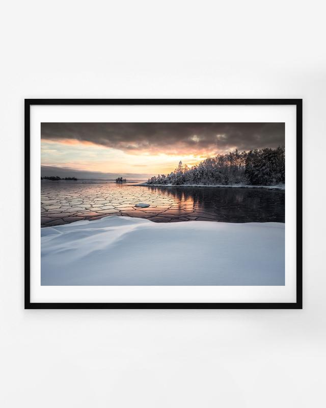

This is a behind-the-scenes story on how I captured the Frozen Patterns photograph. One of the photographs from my upcoming print collection, In the Solitude. It was a cold winter day on the coast of Finland near Inkoo. A place I have visited many times.

Wandering around the area was mesmerizing. I couldn't help but feel a sense of awe at the natural beauty surrounding me. Walking along the coast, I saw a frozen sea, a surface covered in unique and intricate patterns. The ice was like a canvas, displaying a masterpiece of nature's art. I knew I had to capture this moment, to freeze it in time forever. And so, I set up my camera and began to compose the shot.

As I set up my camera on the tripod, I couldn't help but feel a sense of familiarity with the place. I had been to this spot many times before, but I had never seen it like this. The sun was setting, casting a warm glow over the snow-covered landscape. The sky was painted with orange light, and the clouds seemed to be on fire.

I knew I had to capture this moment. I adjusted my aperture and shutter speed, composing the shot to include the beauty of the untouched snow and patterns of the ice with the stunning light behind the trees. As I clicked the shutter, I felt a rush of excitement. I knew that this photograph would be unique.

As I walked back to my car, I couldn't help but feel grateful for the opportunity to witness such a stunning sunset. The place may have been familiar, but it had never looked so beautiful. I couldn't wait to get home and see the final image, but I knew that no matter how well it turned out, it would never fully capture the magic of that moment.

## How to capture a view like this?

Equipment & Camera Settings  
[Nikon Z 7](https://amzn.to/3Zqqbmx) & [Nikon 24-70 f/4](https://amzn.to/3INAQ4H) and tripod RRS Tripod  
ISO 64, 1/100 sec. exposure, f/8.0 @ 24 mm

### 1. Timing

The weather is an important part of landscape photography, and forecasts are a great tool to use. The best time to photograph ice patterns at the coast is during the winter months, this was captured in February when the temperatures were low enough for the sea to freeze. The patterns in the ice are most visible and intricate during this time. The best time of day to photograph ice patterns is during golden hour, sunrise, or sunset when the light is low, and the sun is not too high in the sky. This type of light also makes details more visible.

### 2. Composition

Once you have the right light, you must think about how you want to compose your shot. Try to include different elements in the frame to create a sense of scale and depth. A good rule of thumb is to use the "rule of thirds," which means placing your main subject off-center to create a more exciting photo. Even tho I broke the rule here myself, I wanted to have the beautiful foreground in the lower thirds of the frame and the patterns in the middle with eyes leading to the trees and to that small island on the horizon.

### 3. Taking sharp photographs

Next, you want to ensure you capture the scenery with the correct settings. For this photo, I used f/8 to capture the scene as sharply as possible with epic detail in the image. I used a tripod to get a sharp photograph, even if the shutter speed wasn’t too slow. Also, I tend to use the camera's self-timer to remove any unnesasery movement.

### 4. Post-processing

You don’t need to edit this type of photograph with multiple layers. You can edit your photo using Lightroom. You can adjust white balance, exposure, and contrast to make your image look how you saw the scenery. There is no right or wrong way to do it. It’s all personal preference. I used only Lightroom in this case to create small changes to the original RAW file. Edited with the help of my [EPIC Preset Collection](/epic-presets). I wanted to have more balance, so I used the built-in filters to balance the foreground and background light.

I hope you enjoyed this BTS post about how I have captured one of my favorite seascape images. If you want this photo as a fine art print, the print collection will be out in a couple of weeks, so stay tuned.

**Let me know if you have any questions or suggestions for my next post.**   
Until next time my fellow photographers, keep on creating!

Here is a short video I wanted to share from that day. Nothing special, but to give you more depth to the story. First, we drove to the coast, spent five hours walking on ice, and finally arrived at the place before sunset. The scene was magical.

View fullsize

Mikko Lagerstedt – Frozen Patterns – 2022, Inkoo Finland

***About the upcoming print.*** *This photograph is not just a decoration, it's a memory captured in time, a piece of art that will remind you of the awe-inspiring beauty of nature every time you look at it. The colors of the sunset and the intricate details of the ice patterns will make a statement in any room and create a serene and calming atmosphere. I am confident that you will love this photograph as much as I do, and I hope it will bring you joy and peace every time you look at it. So don't wait; take a chance on this beautiful piece of art and let it remind you of the serene beauty of nature in your home. Coming soon!* [*Learn more.*](https://www.mikkolagerstedt.com/blog/print-collection-2023)

