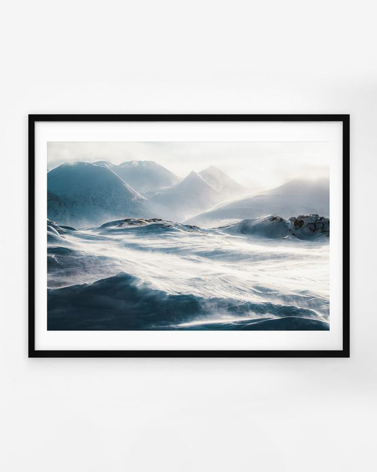

This week let's go behind the scenes of my photograph, The Storm. One of the photographs from my [print collection](/prints). The Swedish Lapland is a unique location. It can be a beautiful place in every season. The winter can be spectacular with a lot of snow.

I captured The Storm photograph in February 2020. I visited the place with my fellow photographers, Konsta and Tobias. Our guide was Magnus, who works in the far north of Sweden. After the first two days of exploring the place, we encountered heavy winds and stunning views.

The wind started to pick up in the late evening and continued to get stronger by the time we left our camp in the morning. We were determined to capture the perfect shot, so we ventured out into the strong wind with our cameras. And as we battled against the elements, we were rewarded with some of the most stunning views I have ever seen. It was hard to see at times as the wind blew the snow straight to my face.

The harsh environment and cold wind made the views look straight from a movie. Cinematic and powerful. I wanted to show the majestic scale of the place and the extreme elements. I walked this small hill and used a low angle to get the perfect composition with light bursting on the top right of the frame. I took hundreds of photographs of this scenery as the gusts moved the snow around. The Storm photograph is my favorite of the view.

View fullsize

Mikko Lagerstedt – The Storm – 2020, Swedish Lapland

### Equipment & Camera Settings

Nikon D810 & Nikon 70-200 f/4   
1/1600 sec. exposure, f/8.0, ISO 64 @ 86 mm

I edited the photograph entirely in Lightroom. Adjusting white balance, exposure, and contrast to make the image look how I saw the scenery. It's all personal preference. Edited with the help of my [EPIC Preset Collection](/epic-presets).

The embed feature is not currently working. Here is [a link to the video](https://youtube.com/shorts/mf2KVwOhC9g).

The following photographs were also captured in the same location on the same day and are part of my print collection.

Through The Storm

Desolation

Windswept

[The Storm](https://mikkolagerstedt.com/prints/p/storm)