Featured

[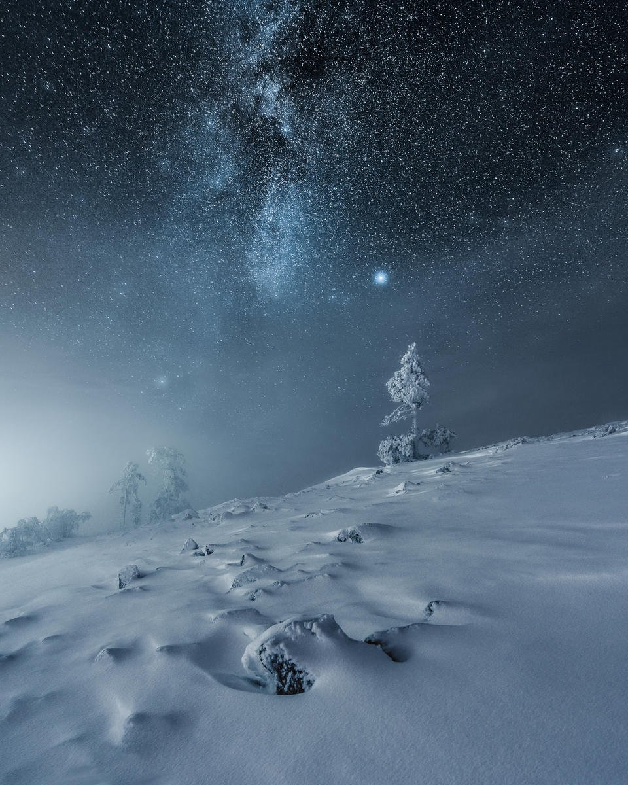](/blog/8-ideas-to-spark-your-creativity-with-photography-projects)

15 Jan 2024

[8 Ideas to Spark Your Creativity With Photography Projects](/blog/8-ideas-to-spark-your-creativity-with-photography-projects)

15 Jan 2024

As a photographer, I have discovered that starting a project can help me channel my creativity and bring new dimensions to my work. A project can be a way to explore new techniques, themes, and perspectives, leading to personal and artistic growth.

15 Jan 2024

[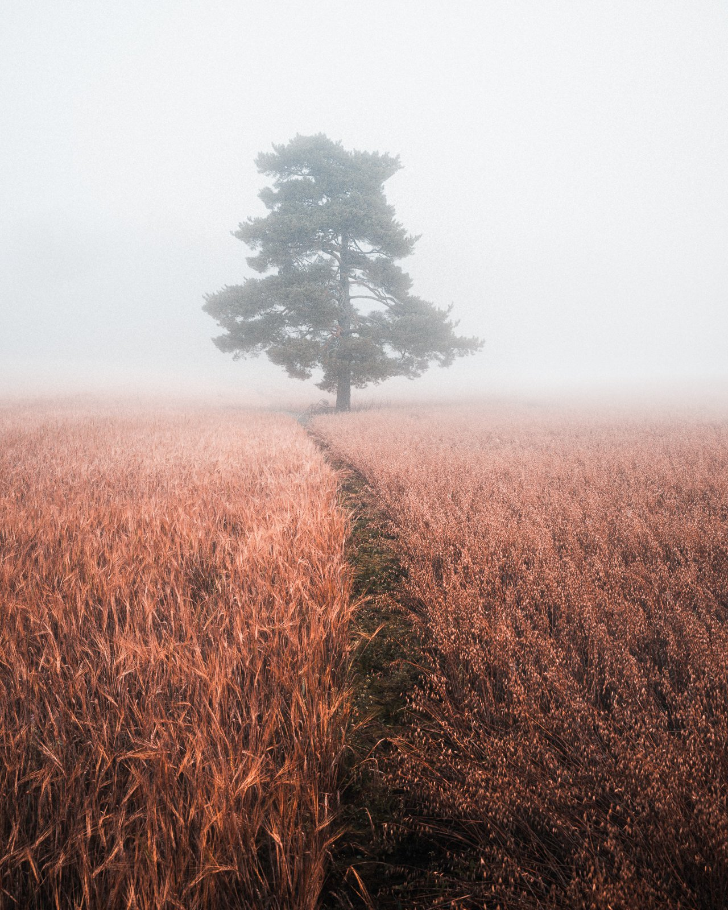](/blog/5-tips-to-capture-beautiful-photographs-nearby)

19 Sept 2023

[5 Tips to Capture Beautiful Photographs Nearby](/blog/5-tips-to-capture-beautiful-photographs-nearby)

19 Sept 2023

In this post, I share five tips with you on how you can capture the unnoticed beauty around you.

19 Sept 2023

[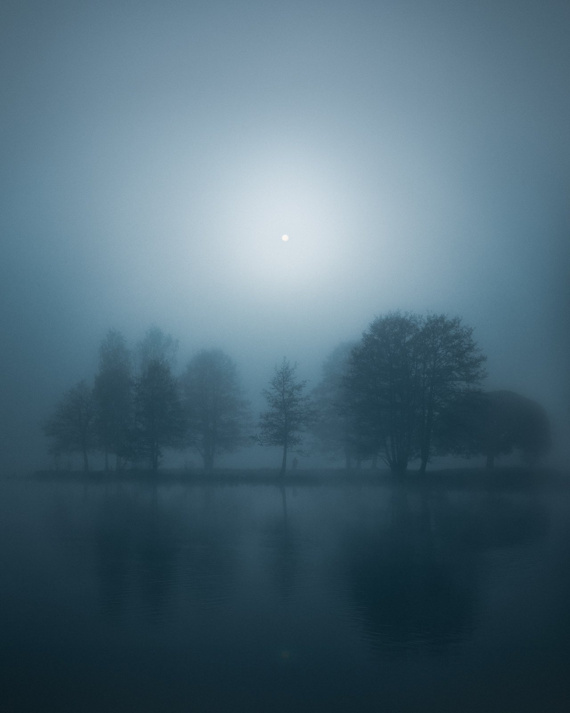](/blog/photography-challenge-with-mikko-discovering-the-unseen)

14 Aug 2023

[Photography Challenge: A Journey of Discovery with Mikko](/blog/photography-challenge-with-mikko-discovering-the-unseen)

14 Aug 2023

Discover the hidden gems in your local surroundings with this month's challenge. Can you capture the unnoticed beauty around you? See where the journey takes you. Let’s be creative together!

14 Aug 2023

[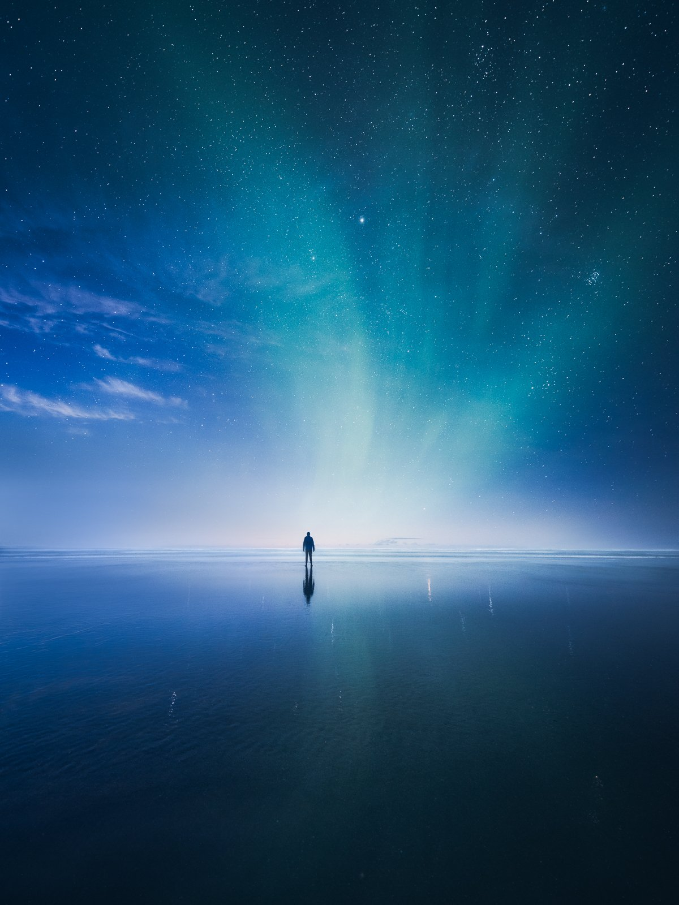](/blog/in-the-solitude-of-nature-exhibition)

27 Jul 2023

[In the Solitude of Nature Exhibition in Helsinki shopping center REDI: 1st of August – 30th of September 2023](/blog/in-the-solitude-of-nature-exhibition)

27 Jul 2023

I’m excited to announce my new exhibition, ‘In the Solitude of Nature.’ It’s an exhibition including my best photography from the Nordics of the past ten years of my photography journey.

27 Jul 2023

[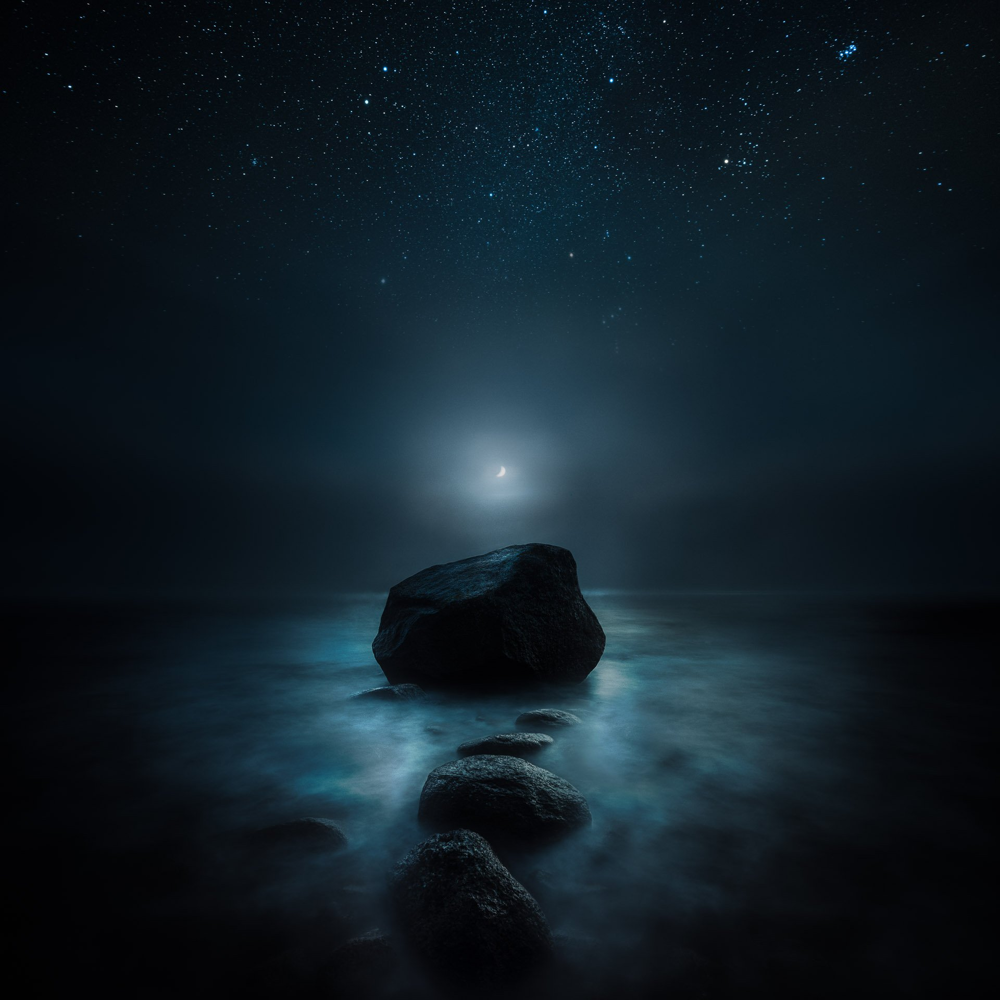](/blog/the-art-of-night-photography)

4 Jul 2023

[The Art of Night Photography](/blog/the-art-of-night-photography)

4 Jul 2023

What is the art of night photography? Why should you try out and develop your night photography? In this week’s tutorial, I share my knowledge about night photography and how you can create unique results by heading out in the dark.

4 Jul 2023

[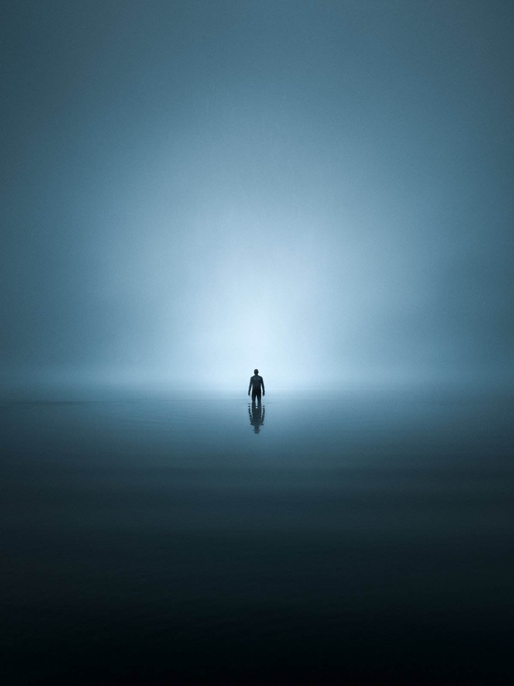](/blog/behind-the-scenes-morning-echo)

18 Jun 2023

[Behind the Scenes: Morning Echo](/blog/behind-the-scenes-morning-echo)

18 Jun 2023

Do you ever wonder what it's like to chase the perfect photo only to find out the real gem wasn't what you expected? I went out to Päijänne Lake in Finland, aiming for some night sky shots, but I ended up with something different. Come along as I share how I caught the "Morning Echo" photograph.

18 Jun 2023

[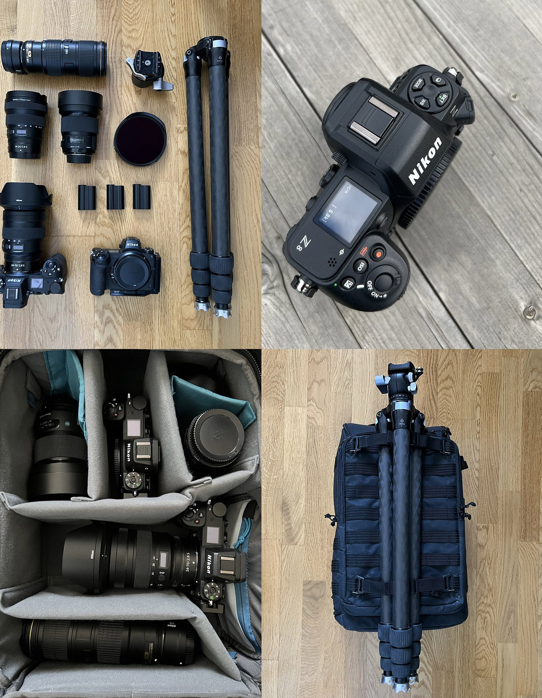](/blog/whats-in-my-camera-bag-in-2023-nikon-z7-ii-or-z8-for-landscape-photography)

18 May 2023

[What's in my camera bag in 2023? Nikon Z7 II or Z8 for landscape photography?](/blog/whats-in-my-camera-bag-in-2023-nikon-z7-ii-or-z8-for-landscape-photography)

18 May 2023

Many people ask about my photography gear. So here is an update to all the gear I use currently and some of the new ones I’ll be receiving shortly. I also recently tried the new Nikon Z8, and it's a great upgrade in some parts...

18 May 2023

[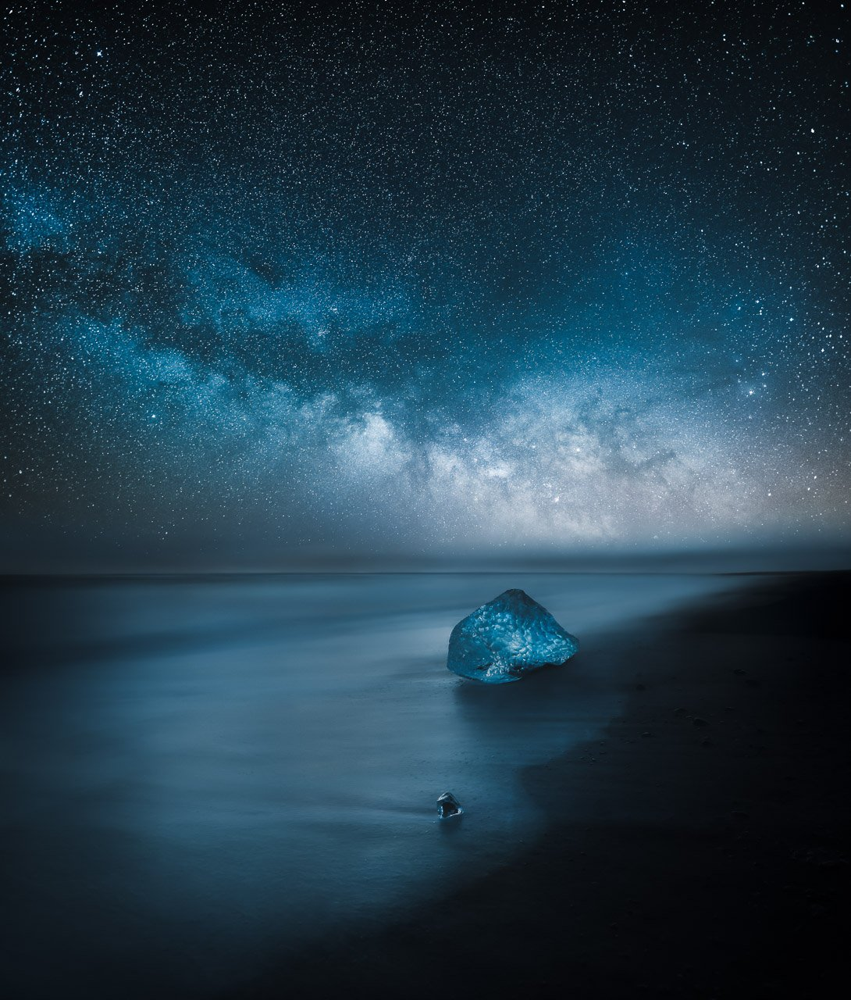](/blog/epic-preset-collection-update-2023)

26 Apr 2023

[The Best Preset Collection for Landscape Photographers: The EPIC Preset Collection 2023 Update](/blog/epic-preset-collection-update-2023)

26 Apr 2023

Making the best Preset Collection even better. Using the latest AI advancements and styling options, the EPIC Preset Collection has it all.

26 Apr 2023

[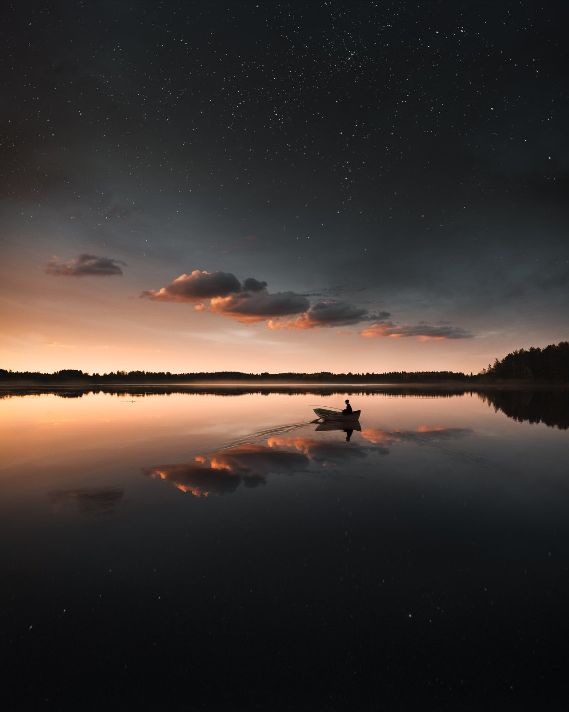](/blog/the-best-ai-image-editing-tools-for-landscape-photographers)

16 Apr 2023

[The Best AI Image Editing Tools for Landscape Photographers 2023](/blog/the-best-ai-image-editing-tools-for-landscape-photographers)

16 Apr 2023

The game-changing world of AI-powered image editing tools for landscape photographers. I delve into how AI can help you save time, enhance image quality, and unleash your creativity. Remember, AI is a powerful tool, but your personal touch is what makes your photography truly unique.

16 Apr 2023

[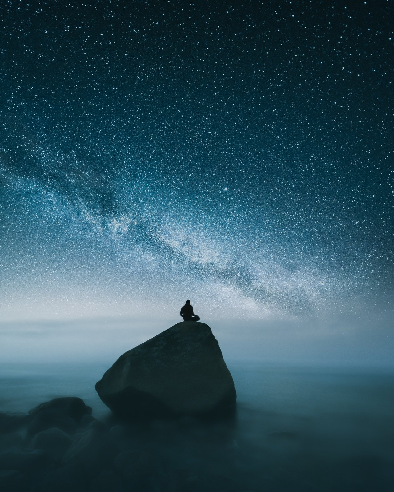](/blog/the-importance-of-a-beginners-mind-in-photography)

6 Apr 2023

[The Importance of a Beginner's Mind in Photography](/blog/the-importance-of-a-beginners-mind-in-photography)

6 Apr 2023

Discover how embracing a beginner's mind has shaped my photography journey and learn how this powerful mindset can unlock your creative potential. In this post, we'll explore the importance of curiosity, stepping out of your comfort zone, learning from mistakes, seeking feedback, and practicing mindfulness. Join me in cultivating a beginner's mind to elevate your photography skills and find inspiration in every shot.

6 Apr 2023

[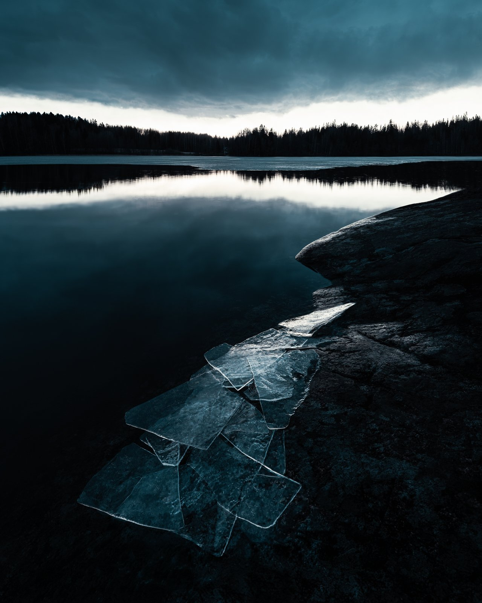](/blog/capturing-the-beauty-of-everyday-landscape)

2 Apr 2023

[Capturing the Beauty of Everyday Landscapes](/blog/capturing-the-beauty-of-everyday-landscape)

2 Apr 2023

In my journey to capture the beauty of everyday landscapes, I've realized that it's not always about traveling far and wide to find breathtaking views. Instead, it's about opening my eyes to the hidden beauty in the world around me, even in the most ordinary places. As I explore my surroundings, I've learned to be more observant. In this blog post, I'll cover several topics that have helped me capture the beauty of everyday landscapes.

2 Apr 2023

[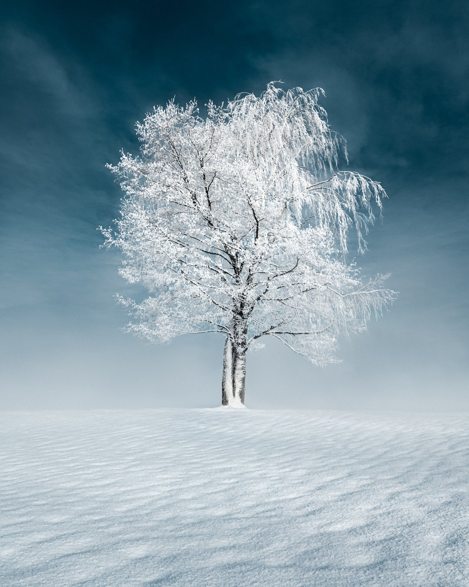](/blog/behind-the-scenes-wonder)

15 Feb 2023

[Behind The Scenes: Wonder](/blog/behind-the-scenes-wonder)

15 Feb 2023

I share the captivating story of capturing my favorite landscape photograph, "Wonder," on a cold and misty morning. I discuss my experience, the composition of the scene, and the equipment and camera settings used. Finally, I explain the post-processing techniques I applied to enhance the image, giving you, the reader, a deeper appreciation for the photograph.

15 Feb 2023

[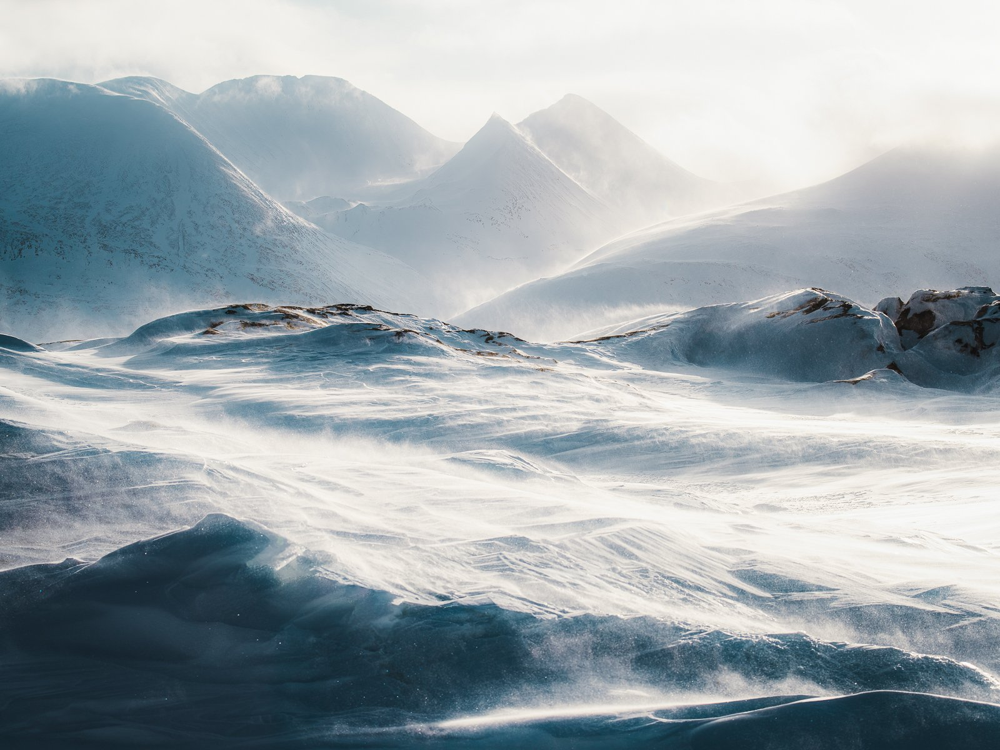](/blog/behind-the-scenes-the-storm)

22 Jan 2023

[Behind The Scenes: The Storm](/blog/behind-the-scenes-the-storm)

22 Jan 2023

I share my experience of visiting the Swedish Lapland with fellow photographers, our encounter with extreme weather conditions, and the breathtaking views we captured amidst the snow and wind.

22 Jan 2023

[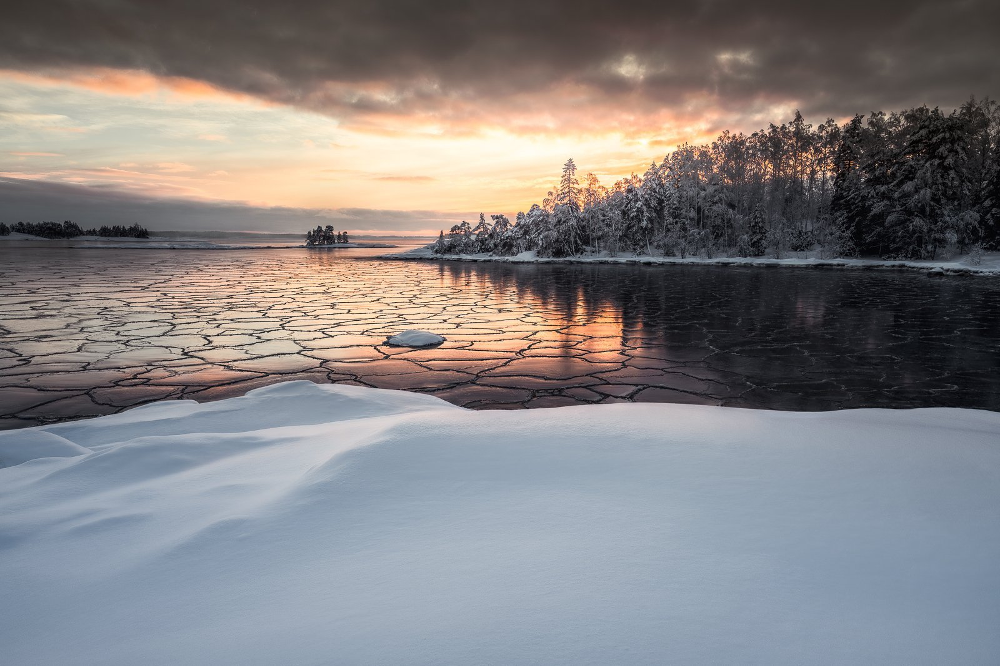](/blog/behind-the-scenes-frozen-patterns)

14 Jan 2023

[Behind The Scenes: Frozen Patterns](/blog/behind-the-scenes-frozen-patterns)

14 Jan 2023

I talk about the awe-inspiring experience of witnessing unique ice patterns on a cold winter day in Finland, the composition, equipment, and camera settings used, and some tips for capturing similar views. Finally, I touch upon post-processing techniques and share a short video from that day to provide more depth to the story.

14 Jan 2023

[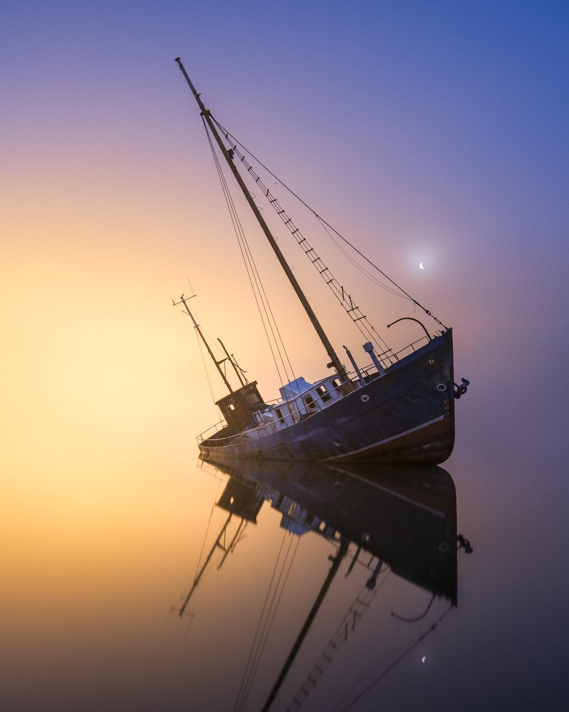](/blog/a-toolkit-to-find-inspiration-for-your-photography)

5 Jan 2023

[Have You Lost Your Inspiration For Photography? A Toolkit to Find Your Inspiration Back.](/blog/a-toolkit-to-find-inspiration-for-your-photography)

5 Jan 2023

I provide a toolkit of ten tips for photographers and creatives who have lost their inspiration, including being ready for inspiration, trying new techniques or subjects, getting out of your comfort zone, finding new topics, journaling, seeking inspiration elsewhere, opening your mind, planning a trip, collaborating with others, and seeking new experiences.

5 Jan 2023

[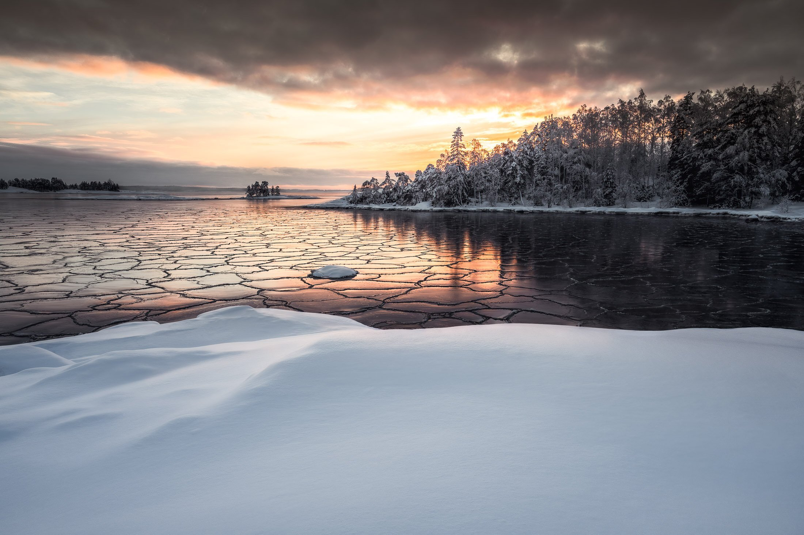](/blog/print-collection-2023)

4 Jan 2023

[Print Collection 2023](/blog/print-collection-2023)

4 Jan 2023

I showcase my favorite landscape photographs that capture the natural world's beauty, majesty, and power in the North. From the Finnish coastline to Swedish Lapland's snowscapes, each print evokes emotions and a sense of awe, aiming to bring the natural world into your home.

4 Jan 2023

[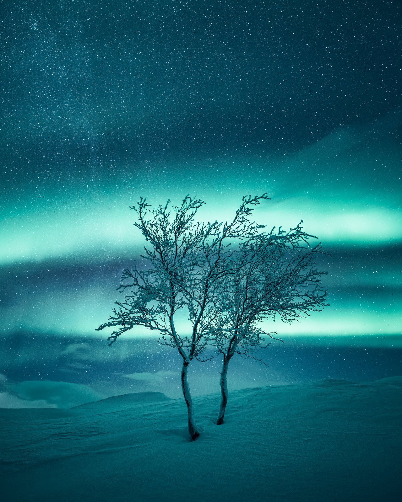](/blog/unlock-your-photography-potential)

28 Dec 2022

[Unlock Your Photography Potential](/blog/unlock-your-photography-potential)

28 Dec 2022

Set attainable photography goals to keep growing and improving. By setting specific goals, you'll stay motivated and inspired. Reflect on past experiences, break goals into smaller steps, and track progress in a journal. Experiment with different techniques and styles, and seek feedback to help you improve.

28 Dec 2022

[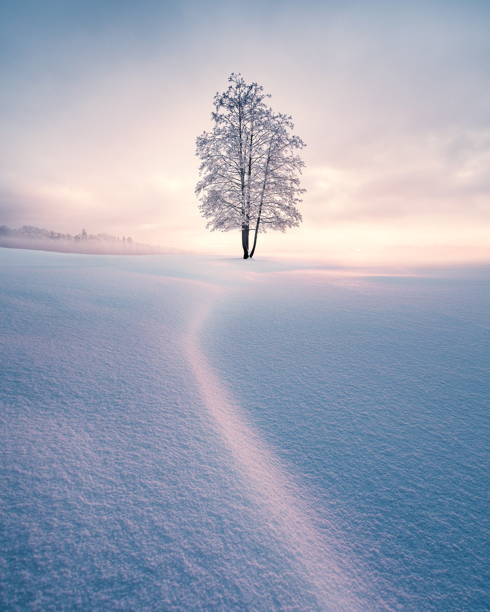](/blog/art-of-capturing-winter-fog-photography)

23 Dec 2022

[The Art Of Capturing Winter Fog Photography](/blog/art-of-capturing-winter-fog-photography)

23 Dec 2022

I will guide you through capturing stunning winter fog photographs in this post. You'll learn about finding the right location, choosing the right time of day, using a tripod, experimenting with white balance and compositions, using a polarizing filter, and editing in Lightroom. Let's get started!

23 Dec 2022

18 Dec 2022

[My Story](/blog/my-story)

18 Dec 2022

This week, I wanted to share a story about myself and my work. Why I create and what motivates me as a photographer. I hope you enjoy what I wrote. It was straight from my heart.

18 Dec 2022

11 Dec 2022

[Editing Minimalistic Photography in Lightroom](/blog/editing-minimalistic-photography-in-lightroom)

11 Dec 2022

Let's talk about how to edit minimalistic photographs in Lightroom. As you may know, I often use The Epic Preset collection to edit my photography because it saves me time and gives me a style I enjoy. But in this tutorial, I show you how I edit my minimalistic photographs in Lightroom if I don't use my presets.

11 Dec 2022

3 Dec 2022

[Minimalistic Photography](/blog/minimalistic-photography)

3 Dec 2022

So what does minimalistic photography include? Minimalistic photography is a style of photography that focuses on simplicity and minimalism. In this kind of photography, simple compositions, clean lines, and a limited color palette make it unique.

3 Dec 2022

[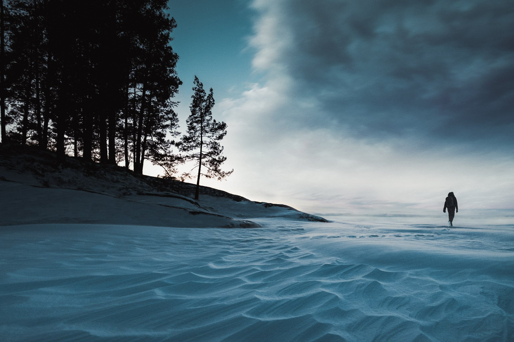](/blog/winter-photography-how-to-photograph-in-difficult-weather)

24 Jan 2022

[Winter photography – How to photograph in difficult Weather](/blog/winter-photography-how-to-photograph-in-difficult-weather)

24 Jan 2022

In this post, I share my experience of capturing winter photographs in difficult weather conditions. I provide details about my camera equipment and clothing and share my location choices. I also share an example photograph, the equipment used to capture it, and the editing process in Lightroom using an EPIC Preset Collection.

24 Jan 2022

16 Jan 2022

[Year 2021 in Photos](/blog/year-2021-in-photos)

16 Jan 2022

16 Jan 2022

5 Dec 2021

[How to become a successful photographer?](/blog/how-to-become-a-successful-photographer)

5 Dec 2021

In this article, I discuss the definition of success and how it applies to photography. Success in photography is not just about financial gain or social media popularity. It's about waking up and feeling proud of your work. To achieve success, you must keep creating and find inspiration in one thing that moves you forward. You must also show up consistently, enjoy the process, and create luck.

5 Dec 2021

25 Nov 2021

[Landscapes With Soul Book](/blog/landscapes-with-soul-book)

25 Nov 2021

25 Nov 2021

[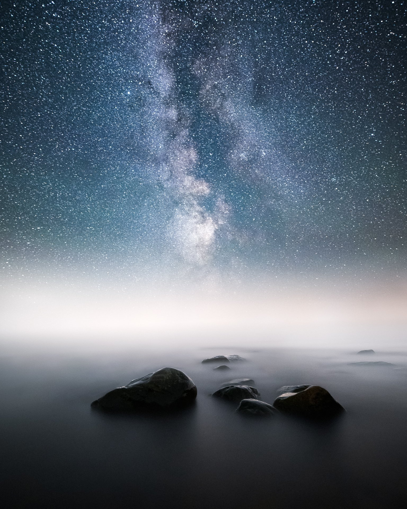](/blog/5-steps-to-create-dreamy-astrophotography-using-a-dual-exposure-technique)

21 Nov 2021

[5 Steps to Create Dreamy Astrophotography Using A Dual Exposure Technique](/blog/5-steps-to-create-dreamy-astrophotography-using-a-dual-exposure-technique)

21 Nov 2021

In this article, I share my five-step process for creating dreamy astrophotography using a dual exposure technique in Lightroom and Photoshop CC. I provide detailed information on the camera settings used for the photographs and walk you through the process.

21 Nov 2021

[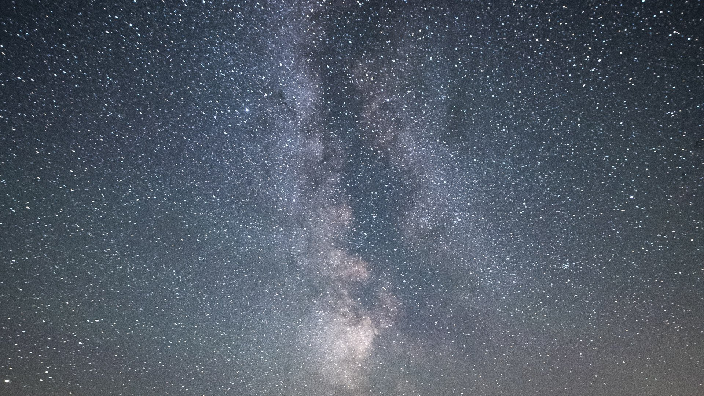](/blog/how-to-edit-astrophotography-in-lightroom)

14 Nov 2021

[4 Easy Steps to Edit Astrophotography in Lightroom](/blog/how-to-edit-astrophotography-in-lightroom)

14 Nov 2021

In this tutorial, we'll use my EPIC Preset Collection, which has a dedicated section for night photography. However, you can still follow along and make the adjustments yourself.

14 Nov 2021

[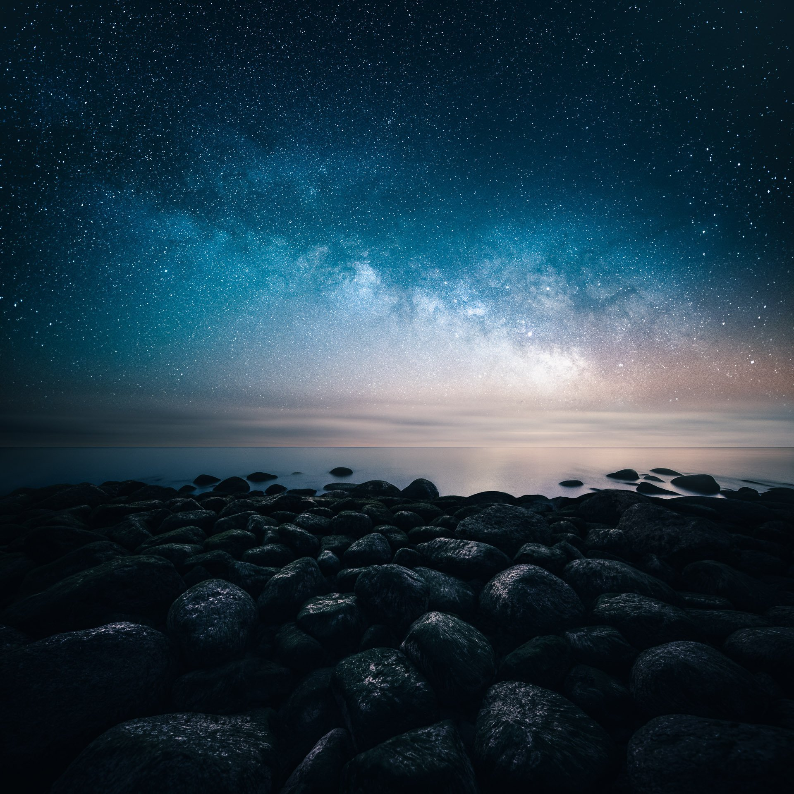](/blog/4-steps-to-capture-beautiful-astrophotography-landscapes)

7 Nov 2021

[4 Easy Steps to Capture Beautiful Astrophotography Landscapes](/blog/4-steps-to-capture-beautiful-astrophotography-landscapes)

7 Nov 2021

In this tutorial, I share my process for capturing beautiful astrophotography landscapes in four easy steps. I'll cover the essential gear needed for astrophotography, planning for astrophotography, capturing the astrophotographs, and using the dual exposure technique to take your astrophotography to another level. You'll learn a few tricks from this article whether you are new to astrophotography or an experienced nighttime shooter. So let's get started!

7 Nov 2021

[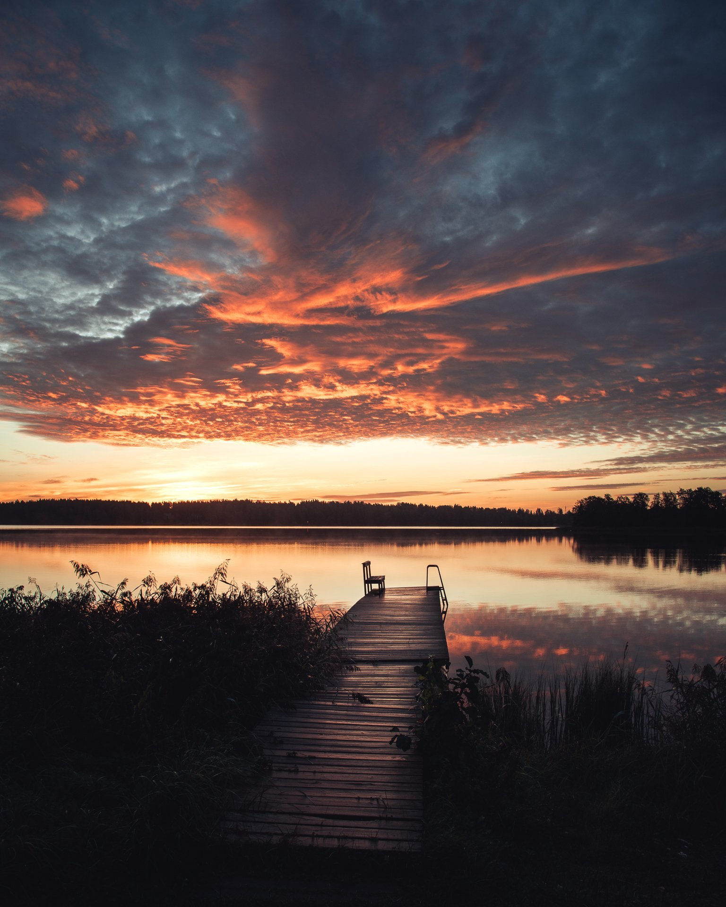](/blog/why-you-need-to-update-to-the-latest-lightroom)

27 Oct 2021

[Why you need to update to the latest version of Lightroom?](/blog/why-you-need-to-update-to-the-latest-lightroom)

27 Oct 2021

27 Oct 2021

[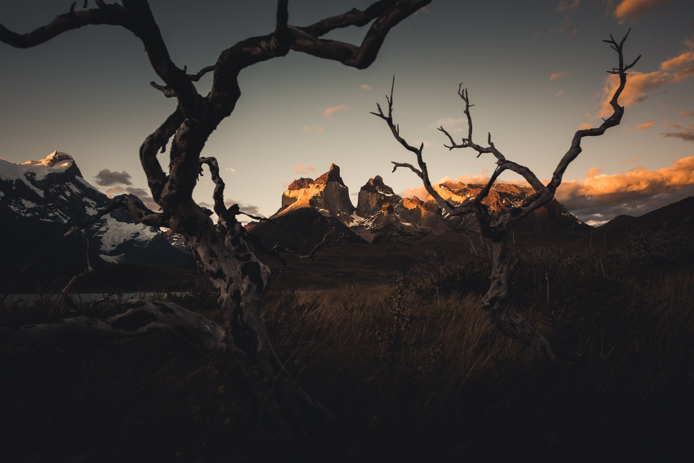](/blog/six-ways-to-improve-your-landscape-photography-instantly)

24 Oct 2021

[Six ways to improve your landscape photography instantly](/blog/six-ways-to-improve-your-landscape-photography-instantly)

24 Oct 2021

In this tutorial, I'll be sharing with you six simple and effective ways to improve your landscape photography instantly, all of which have been put together by the talented Mikko Lagerstedt. This tutorial covers a variety of topics, including how to plan for your photoshoots, why it's essential to take your time to explore the location, how to make the most of a tripod, the best camera settings to use, and some great tips for improving your composition and editing skills.

24 Oct 2021

### [More Posts](/blog)

## Latest Blog Posts by Mikko