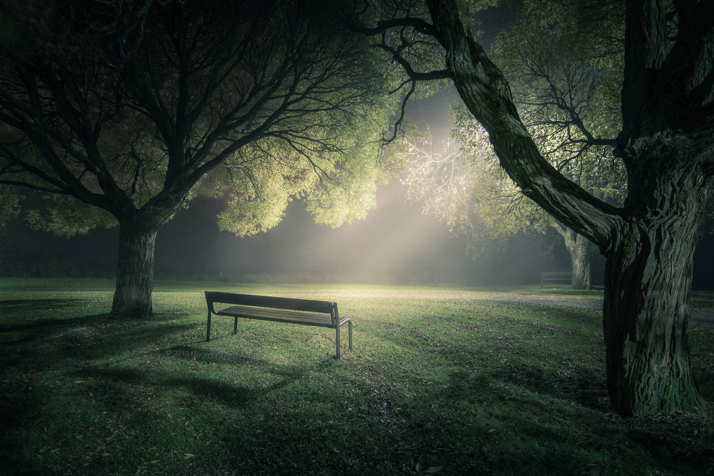

Hi everyone. Usually I try to find something storytelling on a location, but sometimes you find it out later. This was the fact here. I even moved the other bench, when I was there off from the picture to have a cleaner photo - after I saw this photo back from my camera, but the fact that the another bench is hiding behind the tree actually creates this interesting story..

Hope you like it!

Equipment:  
Nikon D800  
Nikon 16 - 35 mm f/4.0  
Sirui Tripod R-4203L + Sirui Ball Head K-40X

22 mm, f/4.0, 30 sec, ISO 100

View fullsize

