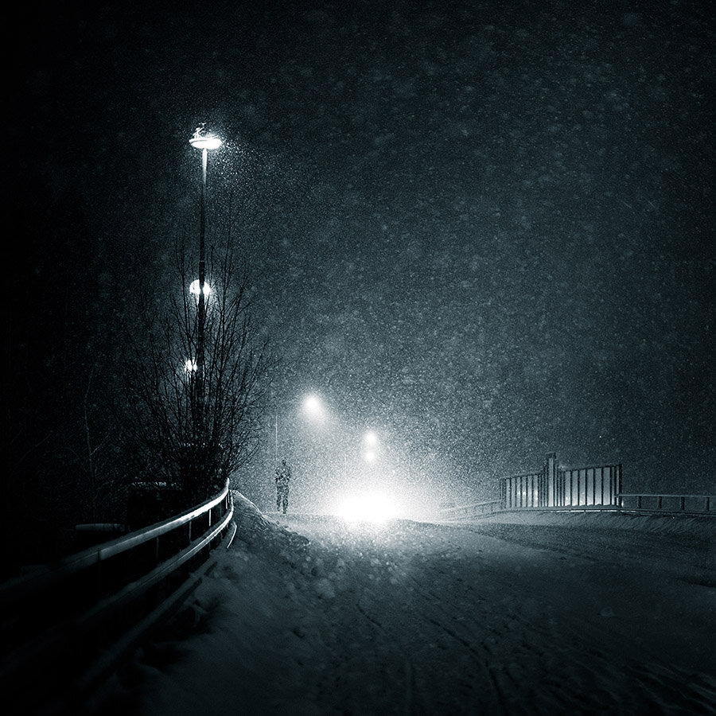

Hey everyone, hope you are well and soon ready for the Holidays!

I present to you my [Fine Art Lightroom Presets](/presets) which I've been working on for a long time. A collection of presets I have used for my work for the past few years. I made three categories: Fog & Atmosphere, Star & Milky Way and Split Toning and also the Full Collection which includes a Fine Art Macro Pack and Basic Adjustments Preset Pack in addition to the above.

View fullsize

This Photo was created by using The Fog & Atmosphere [Lightroom Preset](/presets) -  Blizzard 2012

I'm currently having a **Lightroom****Preset** **Christmas Giveaway** and two of my followers will get the [**Full Collection**](/presets)!

Winners will be announced on 17th December, 2013. And remember the Print Giveaway, winner will be announced also on 17th December.

View fullsize

This photo was created using The Fog & Atmosphere [Lightroom Preset](/presets) - Dawn, 2013

How to participate on **Facebook**:

1. [Like my page](https://www.facebook.com/pages/Photography-Mikko-Lagerstedt/137616549627247?v=wall)
2. [Like my post](https://www.facebook.com/photo.php?fbid=593353710720193&set=a.247608951961339.64538.137616549627247&type=1&theater)

Done!

How to participate on **Google+**:

1. [Follow me on Google+](https://plus.google.com/+MikkoLagerstedt/posts)
2. [Leave a comment to this post](https://plus.google.com/103761326311610249621/posts/47Pg571SdTZ)

Done!

How to participate in **Twitter**:

1. [Follow me on Twitter](https://twitter.com/MikkoLagerstedt)
2. [Re-Tweet this](https://twitter.com/MikkoLagerstedt/status/412870359801532416)

Done!

Here is a interview made by Nathan Wirth an exceptional photographer.  
<http://nlwirth.com/blog/artist-spotlight-mikko-lagerstedt>