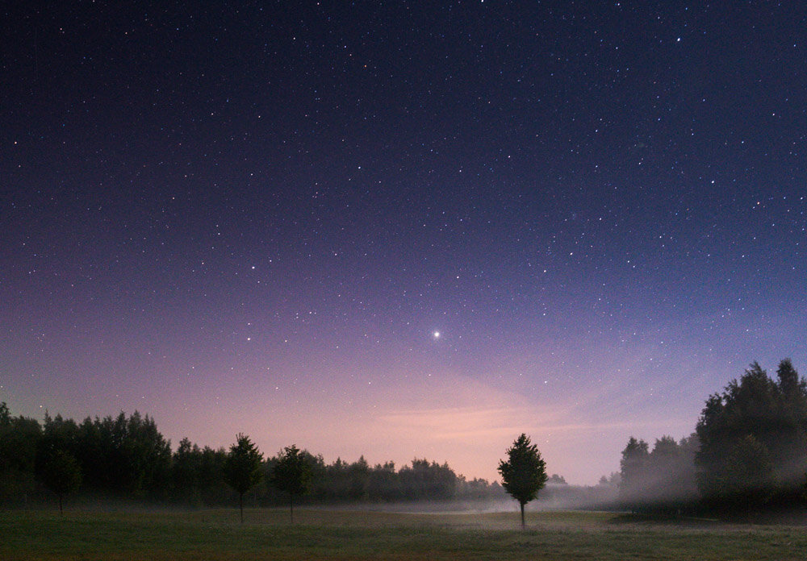

I got few emails regarding photographing the stars. So here are few of my tips to photograph stars and what I do to plan before going out. If you want to learn more about star photography, check out my [eBook: Star Photography Masterclass](/star-photography-tutorial)

### **1. Location Scouting**

This is actually the first thing I do when I plan a trip to photograph the stars. There are various tools you can use for this. I mainly use Google Maps to search for a location that would work good in low light situation. This means that it should be somewhere that has low light pollution. I try to find a place that is at least couple kilometers from a small town or 20 kilometers from a city. I sometimes also go out drive around without a specific place in mind to search for an interesting place.

View fullsize

Something About a Tree - Hanko, Finland - Nikon D800, 35 mm f/4.0, ISO 6400, 15 sec.

### 2. Weather Forecast

f course, you cannot really rely on the forecasts, but you will get a quite good look if there will be clouds in the sky. I also recommend using at least couple of different weather forecast sites to have a wider look at the possibilities in a clear sky.

Sometimes there might be some clouds you were not thinking to photograph, but in that case, you could just try out something different if you can't avoid them. Use clouds as a different approach.

View fullsize

Storm Approaching - Kerava, Finland - Nikon D800, 16 mm f/4.0 ISO 100, 25 sec.

### **3. Timing**

Plan the trip for the darkest moments of the night. This is how you will get most out of the stars. The darker it is the more the stars will show in your capture when you have the correct camera settings. Planning a trip when the moon wont be the brightest also is very important if you want to capture stars. Moon can easily get in the way of milky way.

### **4. Equipment & Settings**

So this is not a list that you should go and buy, just my tools of use.

Tripod, or something to keep your camera steady for long exposures. I have used quite a few tripods and I really like what I currently have a [Sirui Tripod R-4203L](http://www.sirui-photo.us/Sirui-R-Tripod-Series.html) and [Sirui Ball Head K-40X](http://www.siruicanada.com/ballhead/k40x.htm).

Use wide angle lens if you want the stars to appear as dots not trails. My go to lenses for my Nikon D800 are [Samyang 14 mm f/2.8](http://www.samyang.co.uk/index.php/dslr-lenses/samyang-14mm) and [Nikon 16 - 35 mm f/4.0 VR](http://imaging.nikon.com/lineup/lens/zoom/widezoom/af-s_nikkor16-35mmf_4d_ed_vr/index.htm). By using a remote controller it allows you to use longer exposures than 30 seconds. I use [Hähnel Giga T Pro II](http://www.hahnel.ie/index.cfm/action/productSearch/pid/80)  for Nikon and it works nicely for my purposes.

As for **settings**: Always take photos in RAW file format.

Focus to infinity either manually or simply using one bright spot to focus on. Use the widest aperture your lens has as far as the result is not too blurry. Boost up ISO, I would recommend start from ISO 1600 and go up as much as your camera can handle with a decent end result. I tend to take 30 second exposures to have the stars still when you use something like I have above with a full frame camera. For a crop sensor camera I used 11 mm lens with aperture 2.8 and 30 seconds exposure.

View fullsize

Balance - Sipoo, Finland - Nikon D7000, 11 mm, f/2.8 ISO 1600, 30 sec.

### **5. Experiment**

The last but not least tip is to experiment on a location, and it's lots of fun! So if you have found a location you think fits for the purposes of taking pictures of stars try experimenting with different exposures and perspectives. Don't just settle on one spot try search around if you see something interesting to include in the frame. In fact, I rarely get the shot I was looking for in one shot.. I take multiple shots and experiment with perspectives and subjects.

View fullsize

Blue Night - Kuopio, Finland - Nikon D800, 16 mm, f/4.0, ISO 3200, 30 sec.

Next tutorial, I will give you an example of what kind of settings I use to combine a photo like below. Also some Lightroom 5 tips on making the adjustments on star photos.

If you liked this tutorial feel free to visit my eBook: [Star Photography Masterclass](/star-photography-tutorial)