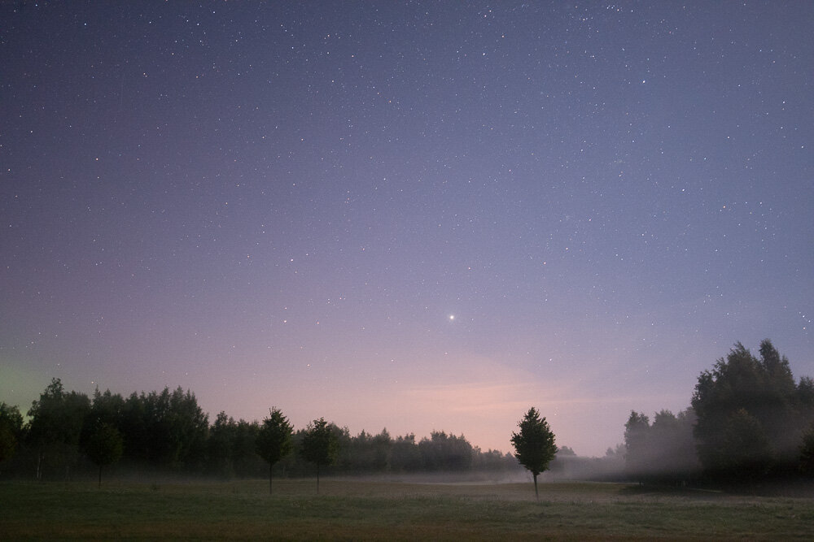

So after a successful photo trip ([Top 5 Tips to Photograph Stars & Night Sky](http://www.mikkolagerstedt.com/blog/2013/11/5/top-5-tips-to-photograph-stars-night-sky)) to take photos of stars, here are a simple process I use to edit the RAW files. These work both in Lightroom 4, 5 and Camera Raw. I edit my pictures in 16 bit mode with Color Profile of Pro Photo and File Format Tif. You can set these in Lightroom 5, from the Edit → Preference →  External Editing. If you want to learn all my tips and tricks, check out my [Star Photography Masterclass](/star-photography-tutorial) eBook.

**Equipment & Exif:**    
Nikon D800, Nikon 16 - 35 mm f/4.0 @ ISO 6400, f/4.0, 35 mm, 15 sec.

**Before:**

View fullsize

**After:**

View fullsize

### **Basic Adjustments**

First thing is to decide how you want the image to look. Going through the main adjustments you can make the changes to the exposure contrast etc. Most of the time I find myself slightly adding exposure and contrast. Here is where I also adjust the color balance via the White Balance sliders. In this example I went towards and added Contrast to +45 and Reduced the Highlights to -36 I added hint of saturation also +7.

View fullsize

### **Graduated Filter & Radial Filter**

The Graduated Filter is excellent tool to use on these kind of images. I used my preset ”Night Sky Clarity” which just adds lot of Contrast and Clarity. (Settings: Exposure 0,29, Contrast 81, Clarity 76) Drag the slider where you want the stars to pop. In this particular image I also added another Slider to darken the top of the frame to give it a balacing sky to the ground. I also darkened the right part of the sky where the moon was. The Radial Filter works basially the same as the Graduated Filter, but adds a circular shaped adjustment. This is a great tool to use if you need to edit a just one part of the sky. For example, you can use it to enhance the detail in Milky Way by adding contrast and exposure strictly to the Milky Way part of the image.

View fullsize

### **Lens Correction**

I used Nikon 16 – 35 mm f/4.0 VR lens in this photo. It has relatively small distortion in 35 mm focal lenght. Simply click on the Enable Lens Correction. I tend to reduce the vignetting settings to 55.  After this I went in the Manual Settings to correct the perspective distortion. In this particular case I adjusted the Vertical Slider to -35, which seemed to work quite nicely.

Sidenote:

For Samyang 14 mm f/2.8 lens you can use the same dialogue if you have installed the preset for the lens. Use Adobe Lens Profile Downloader <http://www.adobe.com/support/downloads/detail.jsp?ftpID=5492> to download the profile. In this particular lens it does very nice work on the distortions and vignetting. I use Nikon D700 version of the correction, because it does perfect job in the D800 also.

View fullsize

View fullsize

### **Detail**

I use this dialogue to adjust the noise reduction. It works very nicely for High ISO captured images. This image was ISO 6400 so it did need some noise reduction. Usually I leave the other adjustments to default. In this case I added luminance noise reduction to 25.

View fullsize

### **Boost up the Stars In Photoshop**

Use commands CTRL / CMD + E to open the file in Photoshop. Go to Select → Color Range → Select stars with the Sample Tool. In this case easiest ways to see the selection is to use Selection Preview: Black Matte. Click OK. Now the stars are loaded as selection and use the shortcut CTRL / CMD + J to duplicate the selection to another layer. After this set the layer Blending Mode to Screen. If you want to boost the stars even further, make a duplicate of the current layer with the same shortcut.  Select the Layers you just created and add them to a group with shortcut CTRL / CMD + G and add a mask to it from the layers panel, if you need to reduce the adjustments from a particular spot in the image. Brush with black and you are done.

View fullsize

Step one in Photoshop - Boost up the Stars - Selection

View fullsize

Step two in Photoshop - Boost up the Stars - Selection Done

View fullsize

Step three in Photoshop - Boost up the Stars - Duplicate The Layers

View fullsize

Step four in Photoshop - Boost up the Stars - Group The Layers

View fullsize

Step five in Photoshop - Boost up the Stars - Mask Out

### **Save for Web**

Save the file as tif and open it again in Lightroom.

I do this in Ligthroom 5 because I find the image saving settings easier because I can use presets. Shortcut CTRL + SHIFT + E. I export the files as JPEG, sRGB with Resize to Fit Long Edge for example 1000 pixels and resolution 72. Sharpen For: Screen, Amount: Standard and you are done.

I try to make another tutorial on how to combine multiple exposures to make a one night photo with extra depth. I didn't manage to have time for it yet, so you will have to wait for it for some time.

View fullsize

[LEARN MORE ABOUT LIGHTROOM PRESETS](/presets)

[Learn More About Photoshop Actions](/actions)