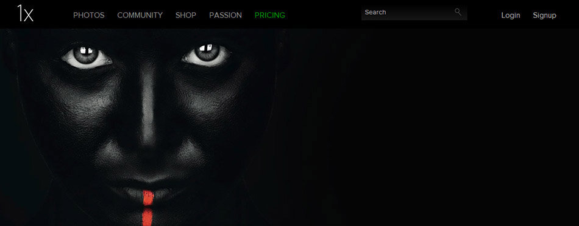

A collection of websites I find very interesting and great sources of inspiration. If you are stuffed with Christmas food and not ready to go out and take photos, you might want to check these sites out. :)

### Photography Inspiration

**1x.com**

Curated photography gallery - a great source of inspiration and a fun community.

**500px**

Lots of photos and a voting system, great site if you want to see what kind of photography is popular among photographers.

**Behance**

A huge community with different creative fields.. Photography, Design, Fashion, etc.

**Colossal**

Daily inspiration source from Design, Photography to Items..

**FFFFOUND!**

Image bookmarking source for anything really.  
*Tip: hit J to go forward and K to go back.*

**Looks Like Good Design**

Source of inspiring projects and photographers.

**My Modern Metropolis**

A blog with all kind of sources of inspiration.

**PetaPixel**

News and inspiration, anything photography related.

### Tutorials

**Abduzeedo**

Even before I stumbled into Photography, I was going through this site. It's a great source of tutorials, inspiration and wallpapers.

**KelbyTV**

For every photographer or photo enthusiast, this site provides excellent video tutorials and talks about photography.

**Phlearn**

One of my favorite sites for Photoshop -tutorials.

Hope you liked the list. Happy Holidays!