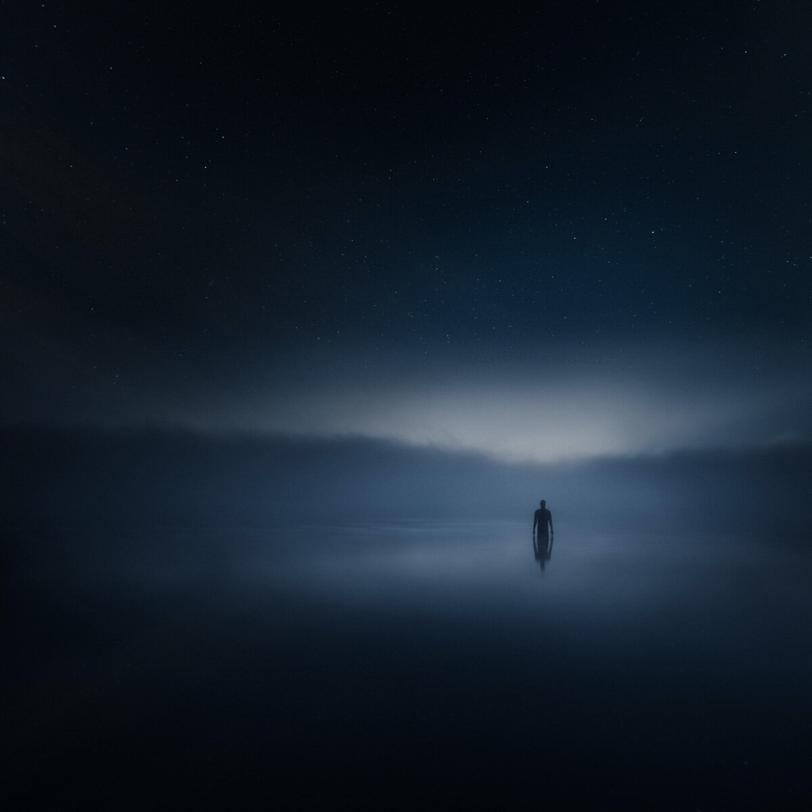

A self portrait I took about a week ago at the lake..  
The night was quite chilly but the water was warm. Loved to be there.

I hope everyone a great weekend and Happy Mid Summer to all my followers! :)

Remember to check out the print giveaway on my facebook!

**Equipment:**  
Nikon D800  
Nikon 16 - 35 mm f/4.0 VR

**Technique:**   
I used manual focusing on this scenery and self timer 20 sec. After I was satisfied with the composition and focusing I started to walk in the water. After the first few shots I got back to the camera and aimed it up to make this vertorama. I then blended the images in Photoshop and then got back to Lightroom 5 to add slight vignetting and colors in Split Tone to slightly blueish tone.

