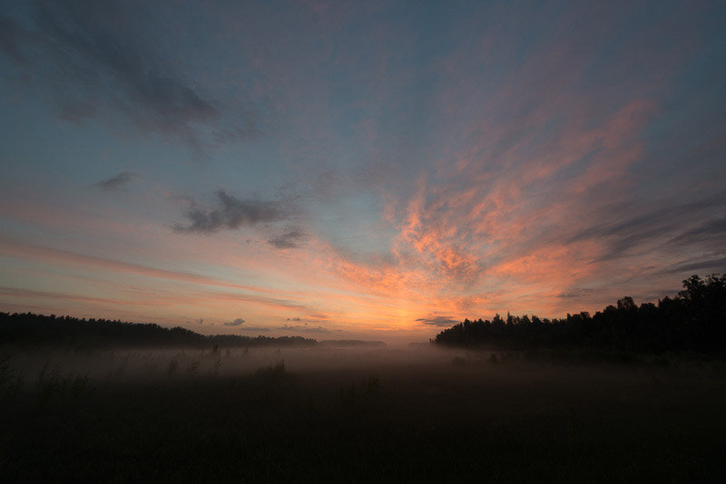

Sometimes when you go out and try to take pictures of something that you had in mind, you will end up with a completely different photo. I managed to be here for the perfect sunrise on this beautiful summer dawn.

This was shot at Tuusulanjärvi, Finland shot with the Nikon D800 and 16-35 mm f/4 VR - lens.

I used one of my favorite fog [presets](/presets) (Vivid Sunrise) to edit this photo. See below before & after photos:

Before - Dawn by Mikko Lagerstedt

View fullsize

After [Lightroom Preset](/presets), Vivid Sunrise - Dawn by Mikko Lagerstedt