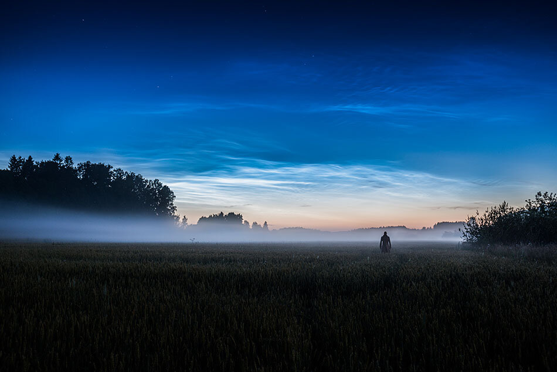

Yesterday I had the chance to capture few photos with Noctilucent clouds.  
It's really incredible how much light comes from these clouds. Here is a self portrait I took. I used a radio trigger to take the picture.

View fullsize

EXIF: Nikon D800, Nikon 16-35mm f/4 @ 35mm f/4, 30 sec. ISO 100