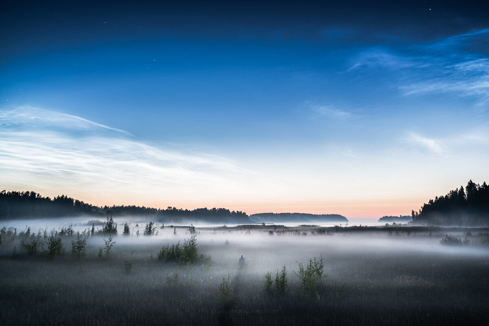

This was shot same place as the [Dawn](http://www.mikkolagerstedt.com/blog/2013/7/17/dawn) - photos.  
I love how the place looked completely different at the night, also how the mist added so much depth to the view. Thanks for viewing, enjoy your week!

### Equipment

Nikon D800, Nikon 16 - 35 mm f/4.0 VR, Sirui Tripod R-4203L & Sirui Ball Head K-40X  
ISO 100, 35 mm, f/4.0, 25 sec.

View fullsize

