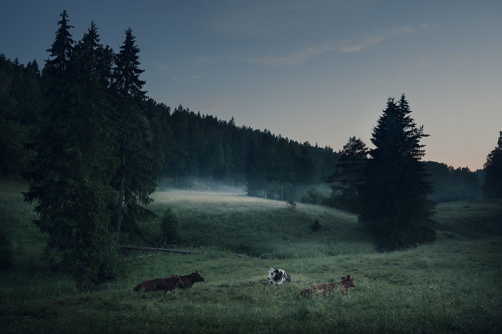

A couple of weeks ago I spent an entire night driving around and searching for something interesting to photograph. I saw some fog in the field and stopped to see if I would see anything else to make the photo more interesting. These four cows were half asleep and I sneaked to take the shot and didn't bother the cows more and drove away.

There was something quite traditional about this place as a Finnish landscape. All of the things: the field, the trees, the fog and the cows were just as in some painting I had seen years ago. I hope you like the picture. It's something different yet very traditional Finnish scenery. 

I hope to make more trips like these in the near future. I love to take pictures at night and in foggy situations. As you have probably guessed! :) 

And the winner of the print giveaway is....

### Dan Holmström

Congrats to the winner! I will contact you via facebook, so check your inbox!

