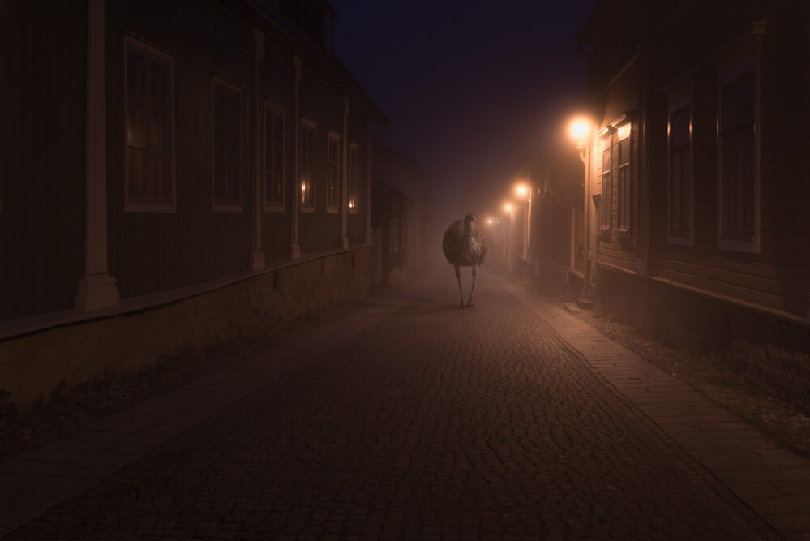

Hey everyone! I'm excited to reveal a new small dreamy series of night animals wondering around the city while people are sleeping. Hope you like it! :)

View fullsize

View fullsize

View fullsize

View fullsize

View fullsize

The 3rd of these - small cat is under a tree, and the cat was really there - which gave me the inspiration to make this fun & mysterious series.   
  
Other images were created using couple of my pictures.