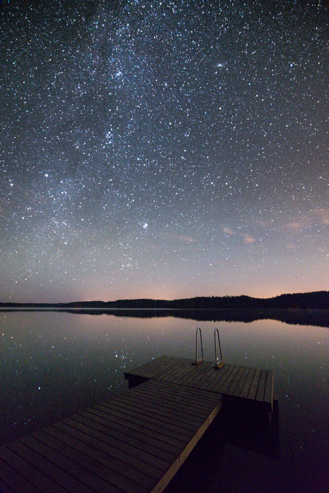

Hey everyone.

I had great time photographing the stars few days ago near Kouvola, Finland. Here is couple of shots I shot while I was there. I used the Samyang 14 mm f/2.8 lens, which turned out to be excellent lens to capture the stars.

View fullsize

View fullsize

Exif:  
1. Nikon D800, Samyang 14 mm f/2.8 @ f/3.2, 30 sec, ISO 6400  
2. Nikon D800, Samyang 14 mm f/2.8 @ f/3.2, 3625 sec, ISO 100