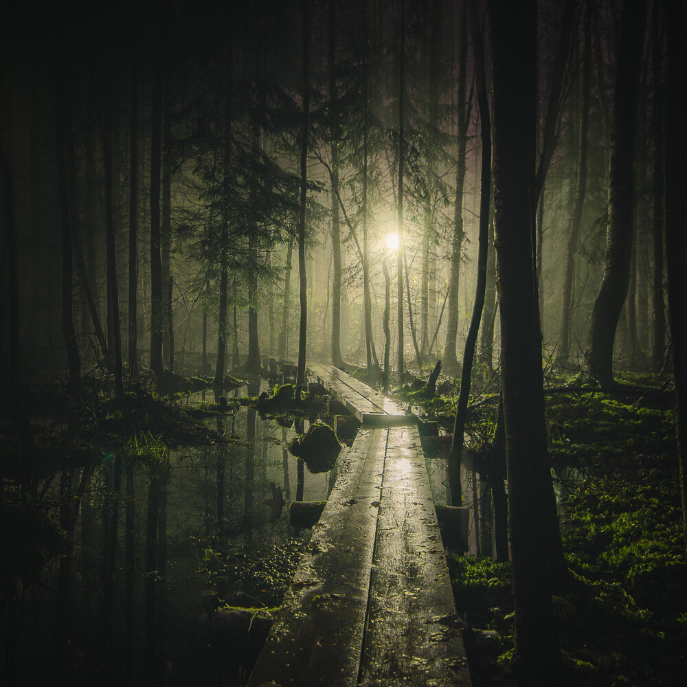

This was taken at Tuusulanjärvi, Finland on one gorgeous foggy night. Walking this boardwalk at the middle of the night was quite scary experience and while I was taking this photograph I heard some strange noises behind me.. Sometimes the best photographs come from the situations you have to push yourself in different ways. Hope you enjoy the photograph!

### Exif:

Nikon D7000, Tokina 11-16 mm f/2.8  
ISO 100, 14 mm, f/2.8, 10 sec

I used one of my upcoming Adobe Photoshop [Lightroom presets](/presets) to edit this one.

View fullsize

Mikko Lagerstedt - Pathway

Want to get the heads up when the new presets set will be available - subscribe to my newsletter below, if you haven't already.