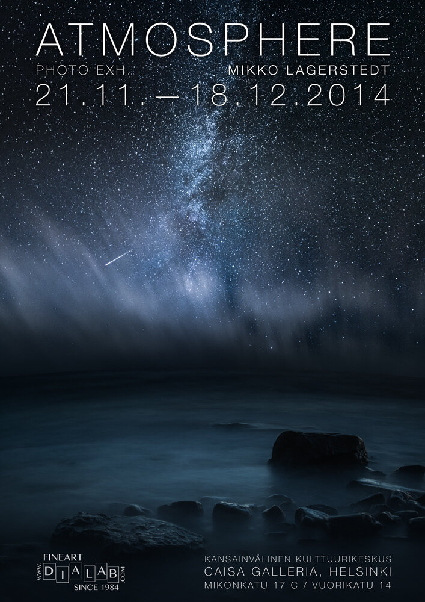

I'm happy to announce my new exhibition [Atmosphere](http://www.caisa.fi/event/FCF131A2D701D202B624A9D51837BEB8/en/Atmosphere). It will be held in Caisa Gallery Helsinki, Finland. The exhibition will be on **21st November** to**18th December**. The gallery is open from Mondays to Fridays. Visiting hours are 9.00 to 18.00.

You can find more information about the location also in English: <http://www.caisa.fi/yhteystiedot>.

You can see the opening event on [Facebook](https://www.facebook.com/events/733907840012241/), make sure to add yourself to the list if you are coming to the exhibition opening.

I have partnered up with [Dialab](http://www.dialab.com) for the prints. Check them out for top quality prints!

