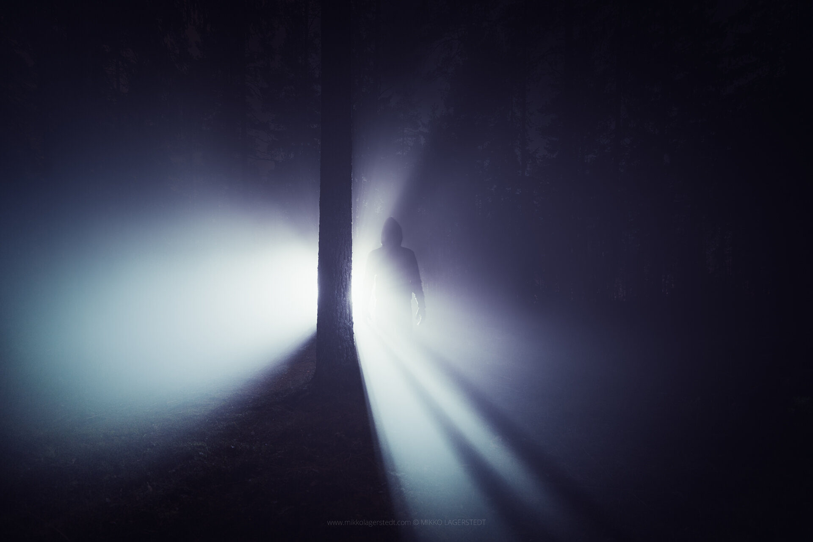

For the last couple of weeks I have been super busy working on my Exhibition Atmosphere. If you are in Helsinki, please go and check it out! More info can be found on my previous [blog post](http://www.mikkolagerstedt.com/blog/2014/10/22/atmosphere-exhibition-caisa-gallery-helsinki) and from [Caisa Gallery](http://www.caisa.fi/event/FCF131A2D701D202B624A9D51837BEB8/en/Atmosphere). Even though I have been super busy, I have managed to photograph every day for the past few weeks. However the weather has not been great where I live. Here are two self-portraits from the time. Hope you enjoy my photos!

Please leave me a message here if you want to meet me in Caisa Gallery! Meet the artist day is on 13th, December.

### Equipment & Exif

Nikon D800, Nikon 16 - 35 mm f/4.0 VR & Sirui Tripod R-4203L and Sirui Ball Head K-40X  
ISO 100, 30 secs. f/4.0 @ 20 mm

Both of these were edited with my upcoming Lightroom Presets. I have been developing the set for a while now and will do some more work on the new preset collection and hopefully it will be released in the next couple of weeks!

View fullsize

Mikko Lagerstedt - Lost in the Mist, 2014

View fullsize

Mikko Lagerstedt - Lost in the Mist II, 2014