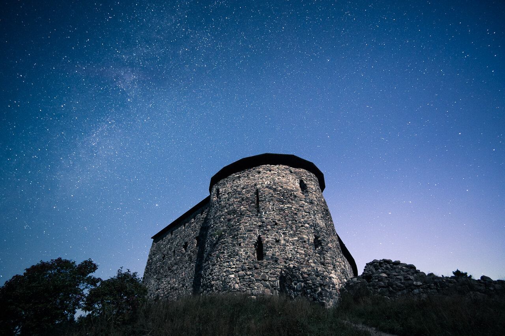

Here is a short video tutorial on how to edit photos by using my [Fine Art Lightroom Presets](/presets).

For these examples, I used the Star & Milky Way presets and the Split Toning Presets.

BTW. It's my first video tutorial, so I must admit that I'm not that great in these.. But hey, you got to start somewhere.. :) Hope you enjoyed it!

Here is a photo I did with these settings.

View fullsize

