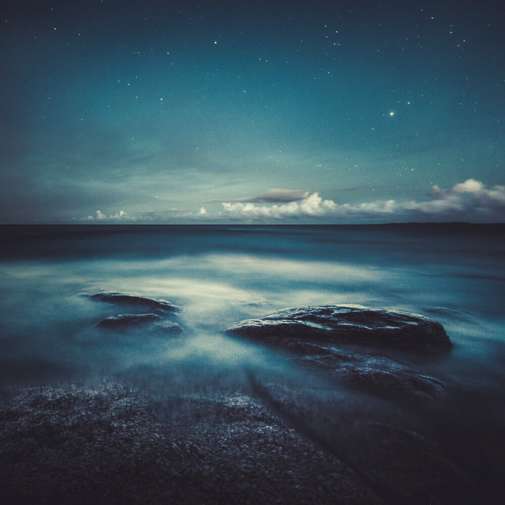

A long night at the coast of Finland. For this photograph, I wanted to capture that everlasting and eternal feeling of movement and constancy. I captured this photograph on the same night as my previously published photograph [Divided](http://www.mikkolagerstedt.com/blog/2014/8/29/divided). I hope you enjoy it as much as I enjoyed to spend the whole night there.

### Equipment & Exif

Nikon D800, Samyang 14 mm f/2.8 & Sirui Tripod R-4203L, and Sirui Ball Head K-40X  
ISO 1600, 30 secs. f/2.8

### Processing

I edited this photograph with my upcoming Lightroom Collection called Phase. The Collection should be available for the public to purchase by next week. I will be still making some changes to it and will be sending it for preview for three lucky owners of my previous [Fine Art Preset Collection](/presets).

View fullsize

Everlasting Moment, 2014 - Mikko Lagerstedt