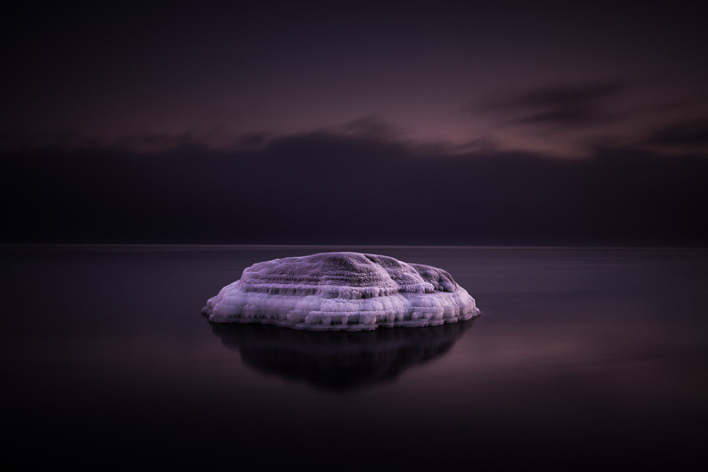

It was freezing cold in Emäsalo, Finland yesterday evening. Just when the sun had set I saw this beautiful frost covered rock in the sea. I had the 10 stop B&W ND -filter on and set the exposure to 90 sec. Hope you like it.

Nikon D800, Nikon 16 - 35 mm f/4.0 & Sirui Tripod R-4203L, Sirui Ball Head K-40X  
35 mm, 90 sec, ISO 100, f/8,0

View fullsize

