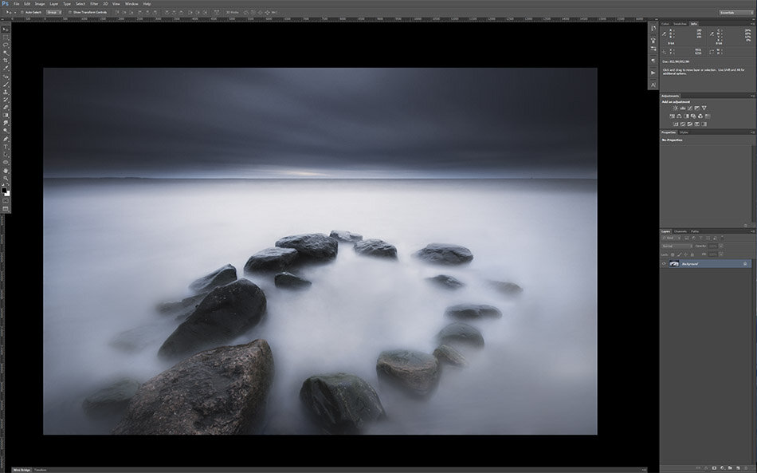

Here is a essential shortcut set for photographers using Photoshop to make your processing faster.

### **Work space:**

**F**  Switch Between Screen Mode

**CTRL+0**  Fit Image In The Screen or Window

**CTRL/CMD +**  Zoom In

**CTRL/CMD -**  Zoom Out

**CTRL/CMD+TAB**Flip through Open Documents

**SPACE** = Move Through Image with Hand Tool

View fullsize

Toggle between Screen Modes with F key

### Tools:

**B**  Brush Tool

**F5** Open Brush Settings Panel

**0 - 9**Set the Opacity of your current tool

**SHIFT + 0 - 9** Set the flow of your current tool

**X**  Switch Between Foreground And Background Color

**D**  Reset Foreground And Background Colors to Black & White

**V**  Move Tool

**C**  Crop Tool

**G**  Gradient Tool

**M**  Selection Tool

**SHIFT+L**  Toggle Lasso Tools

**I**  Eyedropper Tool

**P** Pen Tool

**Z** Zoom Tool

**S**  Clone Stamp Tool

**SHIFT+J**  Toggle Patch Tool, Spot Healing Brush etc.

**SHIFT+O**  Toggle Between Dodge & Burne Tools

**CTRL/CMD+ALT+ Right Mouse Button**  Adjust Brush, Small or Big (Moving mouse to left or right) / Soft or Hard (Moving mouse down or up)

View fullsize

Adjust the Brush Size with CTRL/CMD+ALT and right mouse button moving it up and down and from side to side.

### Layers & Saving

**CTRL/CMD+I**  Invert (Selection and Mask for example)

**CTRL/CMD+ALT+I**  Image Size Adjustments

**CTRL/CMD+ALT+SHIFT+E**  Make A Stamp Visible Layer

**CTRL+ALT+S**  Save As

**CTRL+ALT+SHIFT+S**  Save For Web

*I have added these to the Shortcut Setup ease my work:*

**CTRL/CMD+ALT+SHIFT+K**  Shortcut Setup

**CTRL+ALT+SHIFT+M**  Add Mask (Layer - Reveal All)

**CTRL+ALT+SHIFT+G**  Gaussian Blur ( Filter - Gaussian Blur)

**CTRL+ALT+SHIFT+U**  Unsharp Mask (Filter - Unsharp Mask)

**CTRL+ALT+SHIFT+F**  Flatten Image (Layer - Flatten Image)

View fullsize

Add more keyboard shortcuts through CTRL/CMD+ALT+SHIFT+K (Keyboard Shortcuts and Menus)