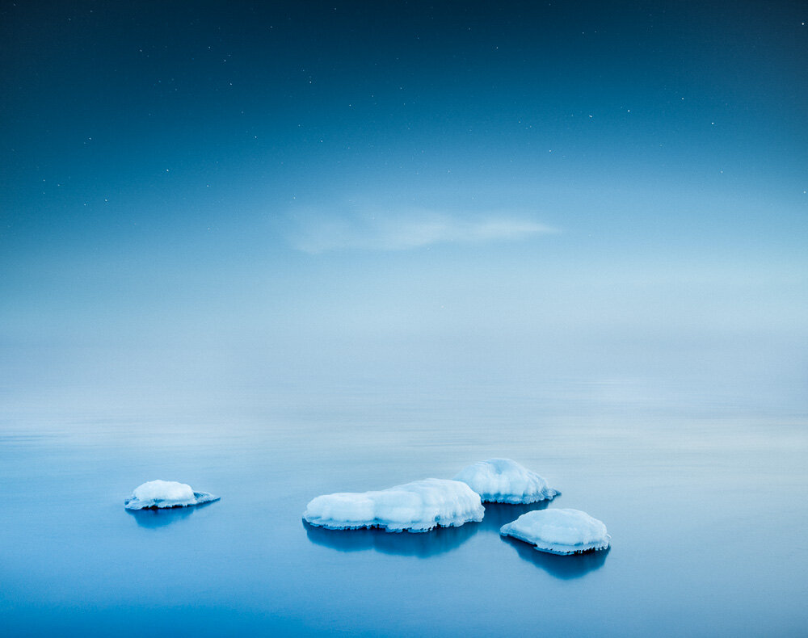

New project from my latest work: Visions from the Edge II

View fullsize

Arctic Symphony

View fullsize

Frozen Echo

View fullsize

Night Tracks

View fullsize

The End

View fullsize

Luminescence

View fullsize

Moonlit

Check it on my Behance profile here: <https://www.behance.net/MikkoLagerstedt>