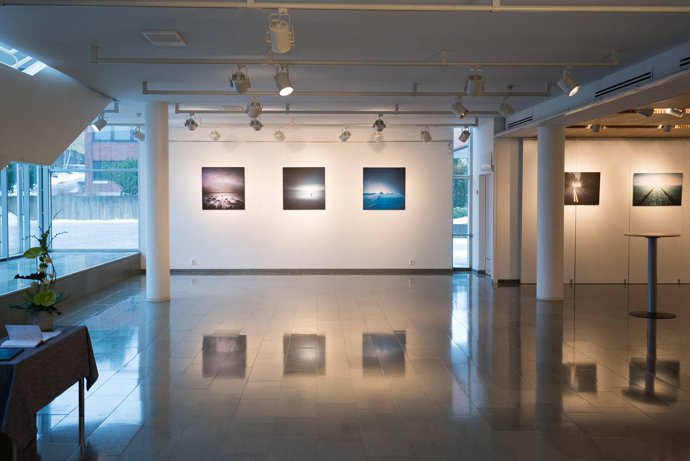

My current solo-exhibition is up and running in Järvenpää-talo, Finland. If you are around let me know and I can meet you there. The exhibition will end on the 1st of March.

The prints turned out absolutely fantastic. Thanks to [Dialab Oy](http://www.dialab.com), [Hahnemühle](http://www.hahnemuehle.com/en/index.html) and [Interfoto Oy](http://www.interfoto.fi/). Here are few shots from the Gallery. The photos don't do service for the prints, so you better go and check them live if you have a chance! :)

Some of these can also be seen in the upcoming Kuva & Kamera Messut, in Helsinki on 7th - 9th, March.

The prints were printed to Hahnemühle Photo Rag 308 gsm paper and mounted to 3 mm Dibond Aluminum.

If you are interested in my fine art photography prints, go and check my [prints page](/prints).