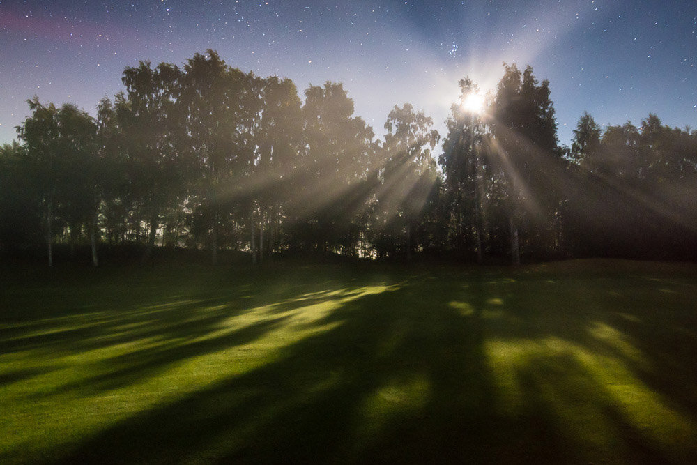

Occasionally when I use my Nikon D800 and Nikkor 16 - 35 mm f/4.0 VR lens, I get these light leaks in long exposure photos also when using high ISO. Here is a quick and easy way to get rid of the light leaks by using the Adjustment Brush.

### Before:

View fullsize

Left Top Corner Red Light Leak

Zoomed Left Top Corner Red Light Leak Zoomed

### Adjustment Brush Settings

Click on the Adjustment Brush, or shortcut K.  
**Effect settings**:  
Temp: - 21, Tint: - 12, Exposure: - 0,15 and Saturation: - 29  
  
**The brush settings:**  
Size: 9.0, Feather: 45, Flow 26 with Density 100.

I  use these settings for this image, but you may need to edit these according to your base image colors. I also use low flow brush to make smooth transition with the adjustment brush.

Select the Adjustment Brush to Fix The Light Leak

Brush With the Adjustment Brush With Low Flow to Make Smooth Transition

View fullsize

Final Image, corrected Light Leak. Mikko Lagerstedt - Moonlight

Hope you found this helpful. Let me know if you have any tutorials in mind you would like to see!

If you want to prevent these light leaks on happening remember to use eye cap and some kind of light blocker on your lens, for example a cut the end of your lens bag and use it around your lens.