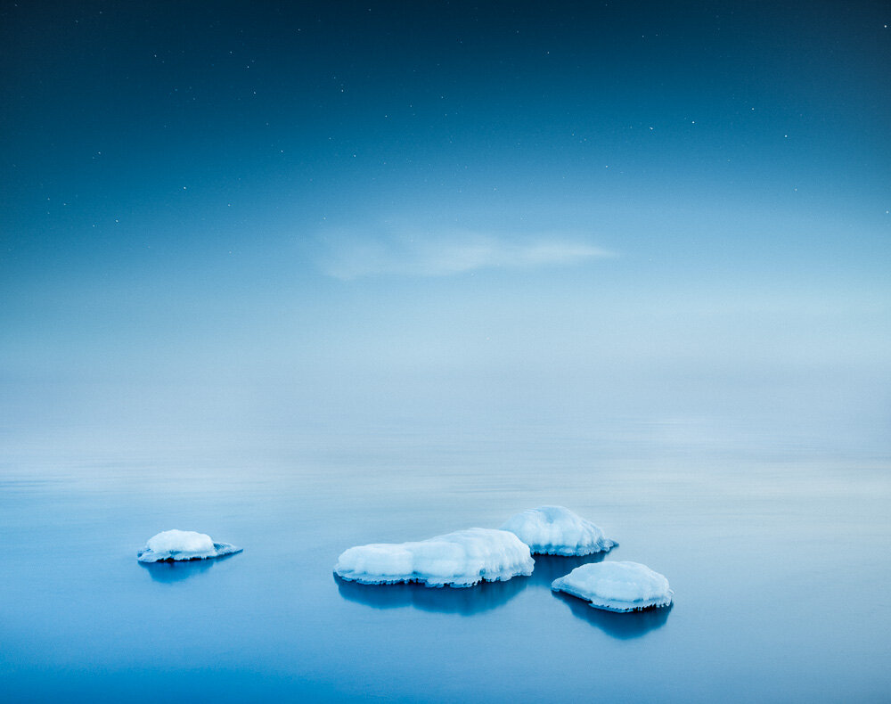

A beautiful evening at the coast of Finland. I loved how the mist made the horizon disappear.  
These moments are really those what I search for when I go out and take photos.

View fullsize

Arctic Symphony - 2014 - Mikko Lagerstedt

Nikon D800, Nikon 16 - 35 mm f/4.0 VR,   
Sirui Tripod R-4203L and Sirui Ball Head K-40X

ISO 100, 30 secs, f/4.0

If you haven't seen, my next Solo Exhibition is starting next week at Järvenpää-talo.   
Here is some more info about the exhibition: [Edge - Exhibtion](http://www.mikkolagerstedt.com/blog/2014/1/18/exhibition-in-jrvenp-talo)

Also if you enjoy Lightroom as I do, check my newly updated [Fine Art Presets](/presets)