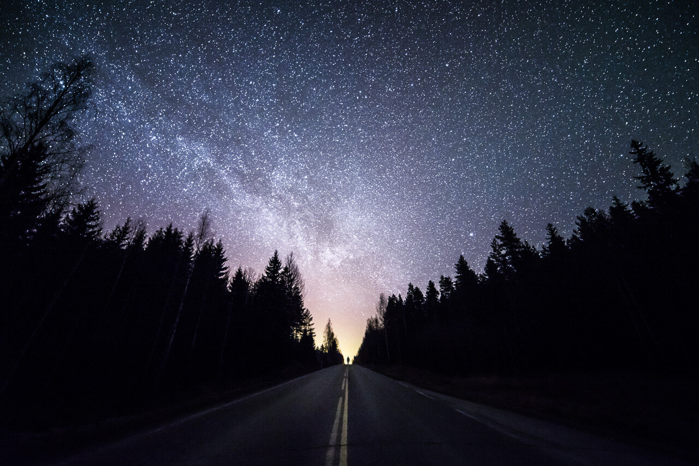

I went out for a shoot last week and as it was predicted, the sky was clear. After a long drive and couple of photos I started to pack my gear and head back to home.

After glancing from my rear view mirror I saw this spot where the sky and the road merged. I stopped my car and put my camera on my tripod and ran to the spot I wanted and used a timer to release the camera shutter. I had to stand still and wait for the camera. Once I saw a light from the camera I had to ran back to it and quickly move it to the side of the road since there was car coming from my back.. Hope you enjoy the photo!

### Equipment

Nikon D800, Samyang 14mm f/2.8  
ISO 6400, 14mm, f/2.8, 30 sec.

### Post-Processing

I used one of my [Star & Milky Way Presets (Enhance)](/presets) as a base edit to this photo.

View fullsize

Highway