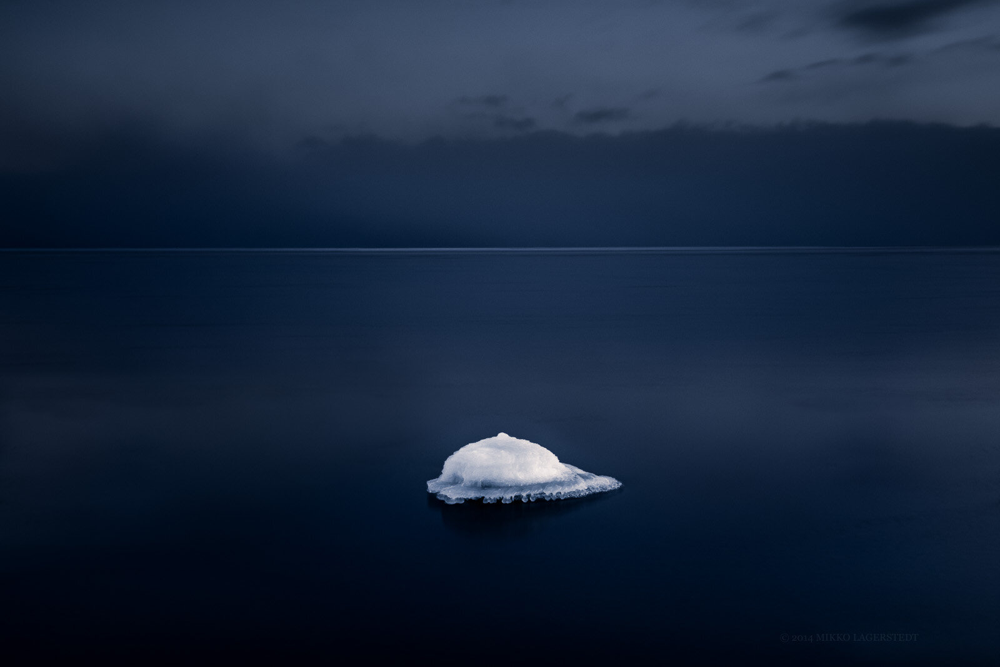

Cold simplicity at the coast of Finland. This seascape image was taken last month, when we still had some snow and cold weather. It seems like Winter has gone quickly this year and we have early spring already. I hope you enjoy this view, I most certainly did.

### Equipment

Nikon D800, Nikon 16 - 35 mm f/4.0 VR, Sirui Tripod R-4203L and Sirui K-40X, B&W 10 Stop ND

ISO 100, 35mm, f/8.0, 30 sec.

View fullsize

Blue