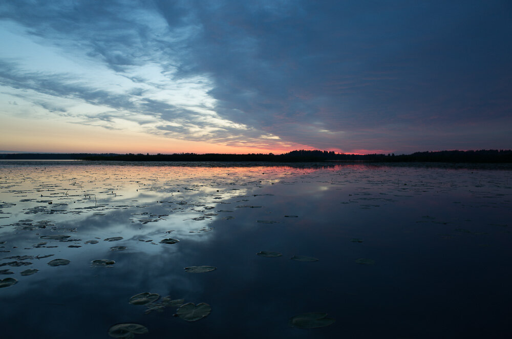

I made a short video tutorial on how to use Graduated Filters and Radial Filter to balance pictures and add colors. Hope you like it.

Sorry that I sound bit weird, but I have the flu. :)

Things I'll go through in the tutorial.

* Balancing photo with Graduated Filter
* Adding color with the Radial Filter
* Using the Radial Filter to add Vignetting
* Basic adjustments

View fullsize

Sunset - Before

View fullsize

Sunset - After Graduated Filters and Radial Filter

I have also gathered my favorite Lightroom settings to presets and provide those here:

[Lightroom & Camera Raw Presets](/presets)