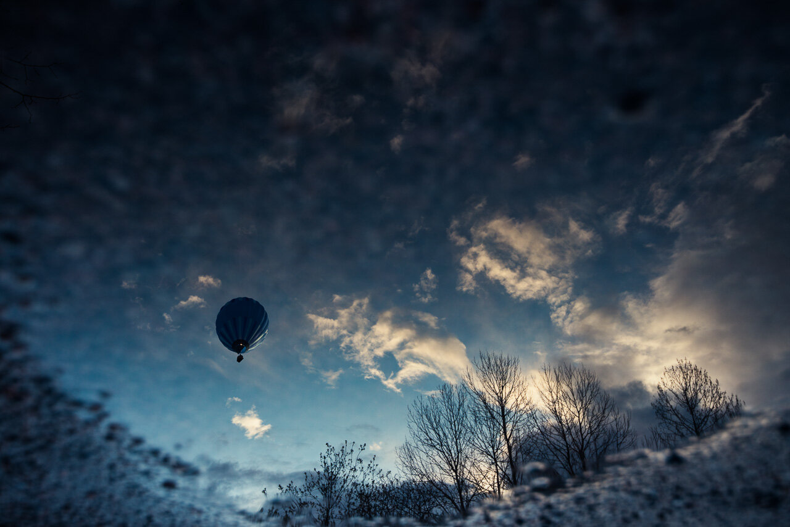

A view reflected from a water puddle. Photographed just few days ago. Somehow I was drawn to capture this hot air balloon from different perspective, I saw it more dreamy this way.

### Equipment:

Nikon D800, Nikon 16 - 35 mm f/4.0 VR

### Post-processing:

Lightroom 5.4 : Contrast, Vignetting and Slight Clarity added.

View fullsize

Reflected - Mikko Lagerstedt - Kerava, Finland 2014