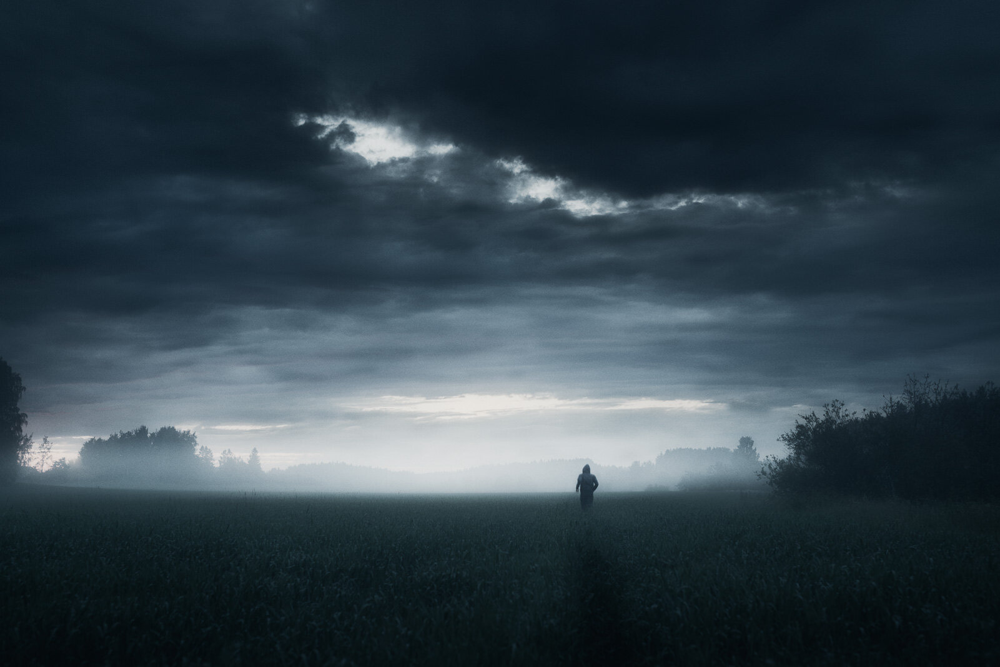

I was searching for some misty landscapes and went to one of my favorite places here in Kerava, Finland. I used my Sirui tripod and then adjusted the self-timer in camera with 10 seconds timer and just ran to the scene. I try to never forget how I have made it to where I'm today - this photo represents my journey and vision. Hope you enjoy my new photograph!

**Post-processing:**  
I used one of my favorite [fine art Lightroom presets](/presets): Dark Blue as the base edit.

**Equipment & Exif:**  
[Nikon D800](http://www.amazon.com/gp/product/B0076AYNXM/ref=as_li_qf_sp_asin_il_tl?ie=UTF8&camp=1789&creative=9325&creativeASIN=B0076AYNXM&linkCode=as2&tag=photomikkolag-20), [Sigma 50mm f/1.4](http://www.amazon.com/gp/product/B0018ZDGAW/ref=as_li_qf_sp_asin_il_tl?ie=UTF8&camp=1789&creative=9325&creativeASIN=B0018ZDGAW&linkCode=as2&tag=photomikkolag-20) & [Sirui R-4203L](http://www.amazon.com/gp/product/B004QC4T46/ref=as_li_qf_sp_asin_il_tl?ie=UTF8&camp=1789&creative=9325&creativeASIN=B004QC4T46&linkCode=as2&tag=photomikkolag-20)  
ISO 100, 50 mm, f/4.5, 1/8 sec.

More info about the tools I use, can be found in the [FAQ-page](/faq).

View fullsize

In the Silence - Mikko Lagerstedt - 2014

View fullsize

In the Silence II - Mikko Lagerstedt - 2014