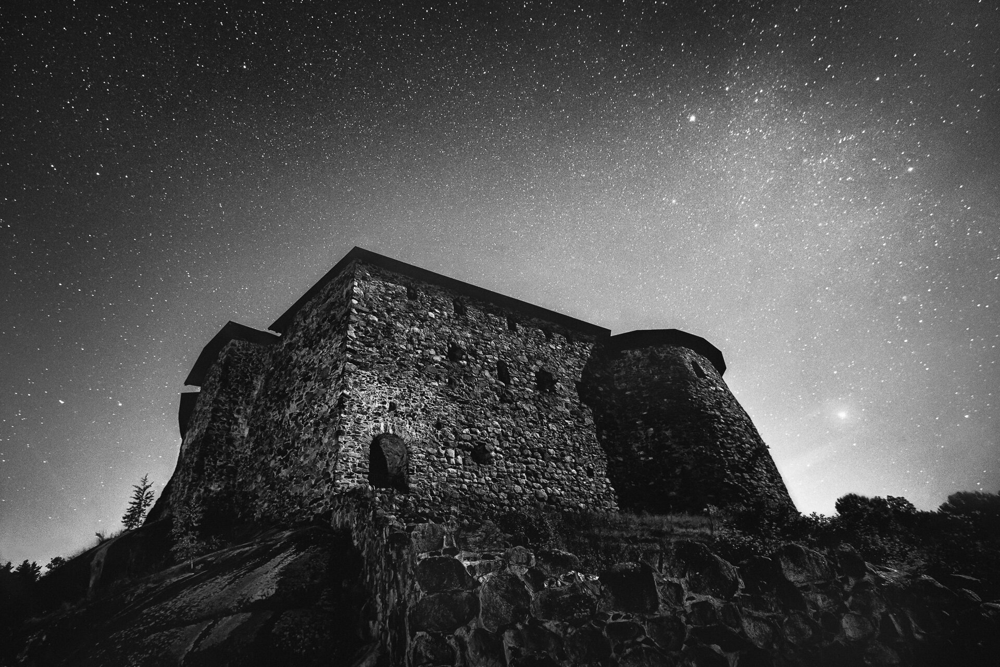

This one is from last year when I had the pleasure to visit this unique place Raasepori Castle. It was a bit haunting to walk around this area on a quiet autumn night. I spent there couple of hours trying to find a perspective I liked, and this one was probably one of the first ones I took from there. The moonlight was quite strong to give the castle some nice texture. Hope you like it!

### Equipment & Exif

Nikon D800, Nikon 16 - 35 mm f/4.0 VR, Sirui R4203-L tripod & Sirui K-40X ball head  
ISO 3200, 16 mm, f/4.0, 30 sec

### Post-processing

Base edit with one of my Star & Milky Way [Lightroom presets](http://www.mikkolagerstedt.com/presets/): Landscape Stars II - and after that I used Nik Software Silver Efex Pro 2 to convert the image to b&w.

View fullsize

Mikko Lagerstedt - Raasepori Castle