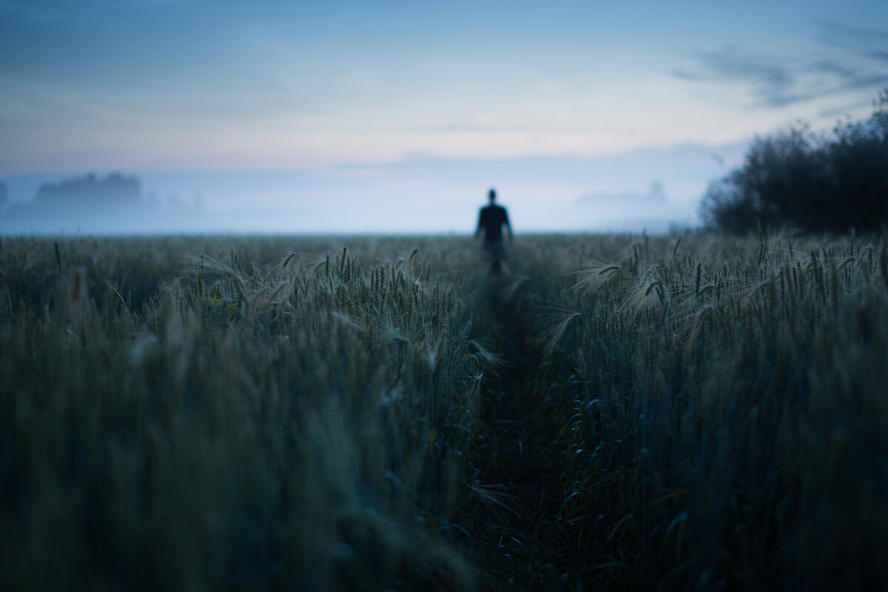

I had this vision for a blurry photograph before I went out at last night. This is how it turned out. Hope you like it!

### Equipment & Exif

Nikon D800, Sigma 50 mm f/1.4,  Sirui R-4203L tripod with K-40X ball head.  
*ISO 100, 50 mm, f/1.4, 5.0 sec.*

View fullsize

Path - Mikko lagerstedt - 2014