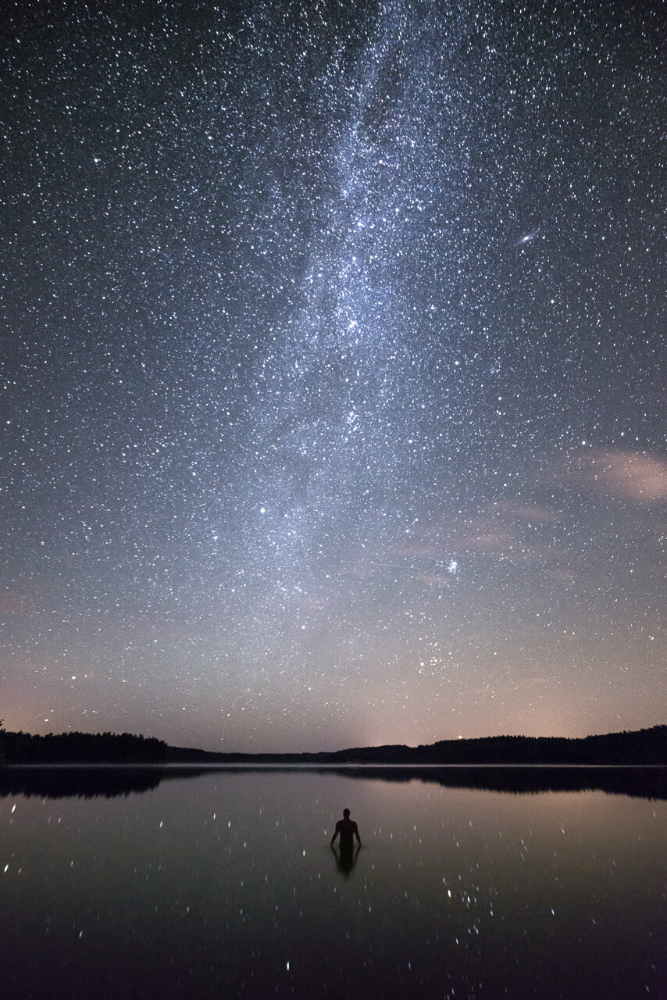

A view of a beautiful night from last autumn. I was really enjoying this quiet moment. It is me in the picture - I had to adjust the perspective quite a bit to get it straight like this, but it was worth it.

### Equipment & Exif

Nikon D800, Samyang 14 mm f/2.8, Sirui R-4203L Tripod and Hähnel Giga Pro II Remote  
ISO 3200, 14 mm, f/3.2, 30 sec. 

### Post-processing

For the base edit I used one of my [Star & Milky Way Lightroom Presets:](/presets) Landscape - Stars.   
In Photoshop I straightened the subject using Puppet Warp -tool. I also added some detail to the stars using one of my techniques seen here: [Night Photography Tutorial](http://www.mikkolagerstedt.com/blog/2013/11/8/night-photography-tutorial-lightroom-5-photoshop).

[Print of this photo is available here.](http://www.redbubble.com/people/mikkolagerstedt/works/12250761-moment-of-elegance)

View fullsize

Mikko Lagerstedt - Moment of Elegance, 2014