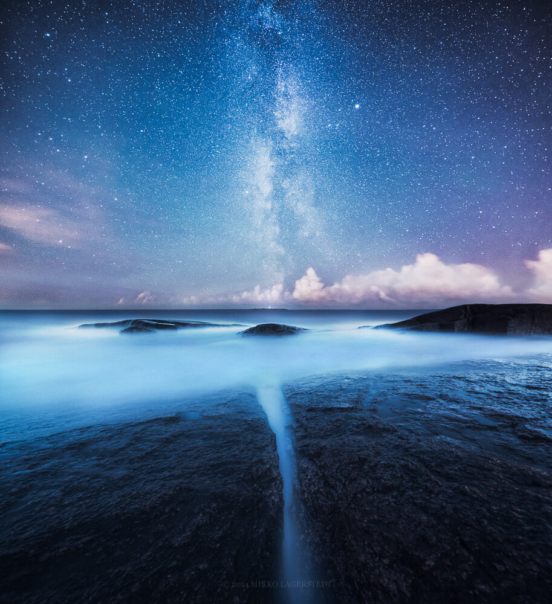

The weather has been quite bad lately, so after glancing at the weather report, and finding out it should be clear skies for couple of hours near Pori, I had to go and take some star photos. I had an awesome trip. I drove around the area and captured couple of photographs. Here is first from the set.

The photograph is blended from two different exposure. First one was exposed for sky and the second was for the water/foreground.

### Equipment & Exif

Nikon D800, Samyang 14 mm f/2.8, Sirui R-4203L Tripod & K-40X Ball Head, Apature Remote Controller

Sky Exposure: ISO 3200, 14 mm, f/2.8, 30 sec.  
Foreground Exposure: ISO 100, 14 mm, f/8, 669 sec.

### Post-processing

For the sky photograph, I used for base editing one of my [Milky Way presets: Subtle II](/presets). For the foreground I adjusted contrast and clarity and boosted up the exposure. After the Lightroom settings were done, I used Photoshop to manually merge the exposures together.

I'm currently working on a Photoshop Action Pack, which will include my favorite adjustments inside Photoshop. Hopefully they will be available in couple of weeks.

Thanks for viewing, I hope you enjoy the photograph!

Learn to create this photograph in my eBook: [Star Photography Masterclass](/ebook)

[Buy a print of this photograph](https://www.mikkolagerstedt.com/edge-prints/divided)

View fullsize

Divided - Mikko Lagerstedt 2014