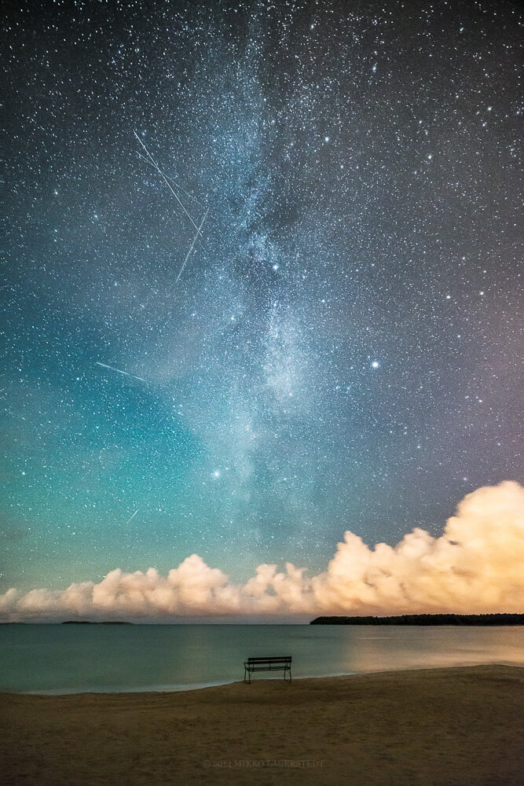

I'm thrilled to show you another photo from the same night as my previous photograph: [Divided](http://www.mikkolagerstedt.com/blog/2014/8/29/divided). I had some fun in Yyteri, Finland walking down the beach alone, just mesmerized by the beauty of life. I tried to capture the beautiful sight I witnessed while sitting on the bench from a spectators perspective. Hope you enjoy it!

### Equipment & Exif

Nikon D800, Samyang 14 mm f/2.8, Sirui R-4203L tripod with K-40X ball head  
ISO 5000, 14 mm, f/2.8, 30 sec.

### Post-processing

For base edit I used my [Fine Art Lightroom Preset](/presets): Landscape - Stars II. I also used Photoshop for the Milky Way with my upcoming [Photoshop Action: Stars Enhance](/actions). Hopefully the Action pack will be ready in the next couple of weeks, still working on it to make it as good as possible.

View fullsize

First Row - Mikko Lagerstedt, 2014

You can subscribe to my newsletter below, if you are interested to receive update as soon as the Fine Art Photoshop Action pack will be available!

First Name

Last Name

Email Address

Sign Up

We respect your privacy.

Thank you!