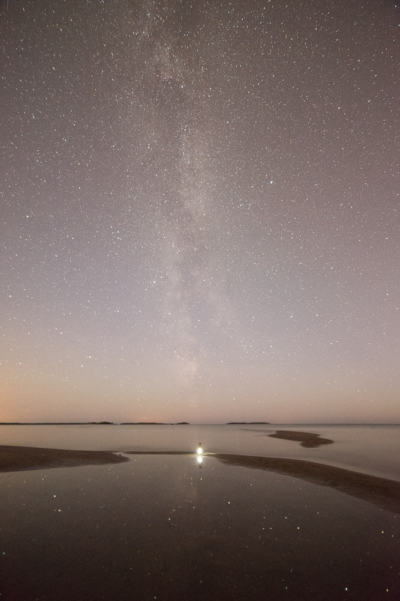

Five steps how to boost stars and Milky Way in Lightroom. First you need a photograph captured in a dark situation pointing towards the Milky Way. Here is an example image captured in Yyteri, Finland. There are many things you need to know and consider before you can shoot these type of sceneries. You can learn these steps from my [Star Photography Masterclass eBook](/star-photography-tutorial): Learn The Secrets of Stunning Astrophotography.

Before

After

### 1. Overall Adjustments

For the editing, it's good to start with the Basic Settings. For this image, I used the following settings. Exposure +0,20, Contrast +20, Highlights -20, Shadows +11, Whites +26, Blacks -15 and Clarity +15. Experimenting with these settings is a good practice.

View fullsize

### 2. Dehaze

This new tool introduced with the Adobe Lightroom CC 2015 version is a great quick fix if you want to boost the Milky Way. You can find it in the Effects Panel. I don't usually go too high with the settings because it tends to exaggerate the colors. For this image, I used +25. You can also use the Dehaze now only in part of your images with the Graduated Filters. This feature was introduced with the Lightroom CC 2015.2.

View fullsize

### 3. Graduated Filter / Radial Filter

Use either Graduated (shortcut M) or Radial Filter (shortcut Shift+M) tool to boost the overall contrast and clarity in the stars. Most of the time I use the graduated filter and occasionally when the image has something in the sky I use the radial filter. Depending on the picture you can experiment with different settings, for this photo I used Exposure -0,1, Contrast +45, Blacks -15 and Clarity 40. Click and drag where you want the effect to be visible.  Here I went ahead and used both of these tools to give the Milky Way an extra boost. See the images for settings. And if you are working with the new version of Lightroom try the Dehaze function as well!

View fullsize

View fullsize

### 4. Adjustment Brush Tool

Use shortcut K, to open the Adjustment Brush tool. For the picture, I used Exposure +0,50 and clarity +50 at 20% flow to boost the brighter parts of Milky Way. Paint over the parts with a relatively big brush. Once satisfied with the result, let's take it even further by darkening the middle of the Milky Way Galaxy. Choose similar to these settings: Exposure -0,50 & Contrast +15.

View fullsize

View fullsize

### 5. Noise Reduction

For the final adjustment, I tend to add noise reduction. For the example image, I used the default settings and added Luminance: +15.

Thanks for viewing! If you have suggestion for new tutorials, leave a comment below.