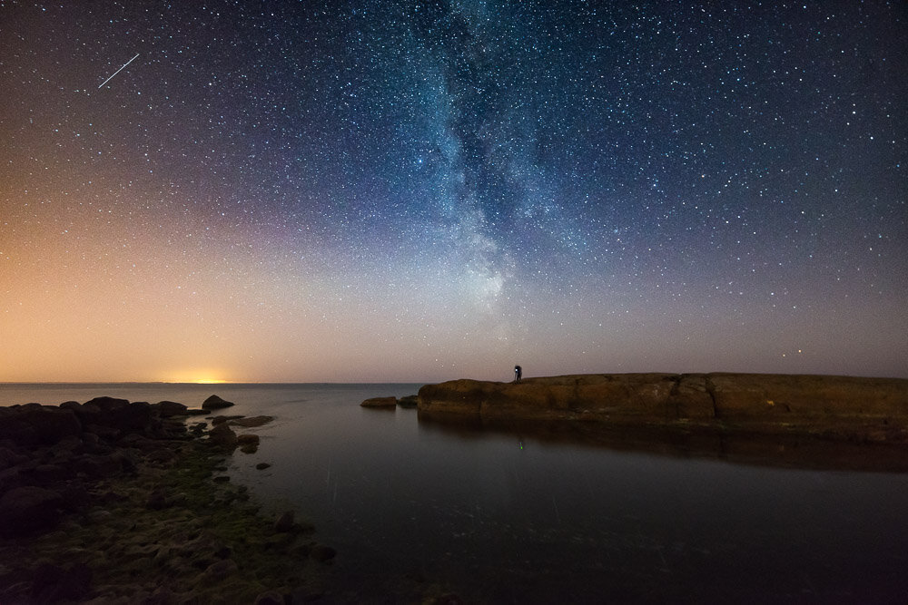

Thanks for the email responses for my last tutorial. I got a couple of questions about how do I manage to get sharp images at night of the stars. In this tutorial, I have listed the key elements you have to master when you want to capture most crisp images at night.

### 1. Focus

If you want the stars to be sharp and in focus, you need to learn how to focus to infinity. Every lens seems to have a slightly different spot when focusing to infinity or near to infinity. Try focusing in daylight and learn the infinity focus point of your lens.

* Capture daylight test images while using the widest possible aperture value
* Photograph a vast landscape or subject far away
* Use the live view mode zoomed to refine the focus in manual focusing mode
* Import the pictures to your computer to examine further

### 2. Camera Equipment

Use a wide-angle lens with a wide aperture to capture Milky Way and stars. If you are photographing on a windy night, get a decent tripod and use counter weight to keep the tripod steady. You can view my gear recommendations for star photography here: <http://www.star-photography-tutorial.com/gear>. Here is a quick list on what I recommend getting:

* Wide-angle lens: [View my Nikkor 14-24 mm f/2.8 Review](http://www.mikkolagerstedt.com/blog/2015/10/13/nikkor-1424-mm-f28-g-ed-review-night-photography)
* Light sensitive Camera (decent ISO performance) — I tend to use ISO settings up to 8000
* Steady Tripod — When you need to get that extra sharpness get a decent tripod
* Remote controller, or built-in camera timer — If you use the timer set it to five seconds so the camera has enough time to settle before it takes the photograph

View fullsize

Meri-Pori, Finland - Nikon D800, Samyang 14 mm f/2.8

### 3. Camera settings

The wider your lens is, the longer shutter speed you can use to capture stars without movement. When you need shorter shutter speed, use higher ISO settings. Check out my cheat sheet of camera settings: [here](http://www.star-photography-tutorial.com/gear).

* High ISO — I use ISO 3200 - 8000 most of the time
* f/2.8-4.0 — As wide aperture as possible to capture more light
* 20-30 sec. exposure — Depending on the lens see the link above

### 4. Post-Processing sharpening

Use Lightroom to sharpen your images. You can see the settings from the detail panel.

* Amount 50
* Radius 1,2
* Detail 30

View fullsize

My go-to settings for sharpening star images

Don't export full-size images for the web. It's quite often I see people posting full-size jpg files on social media. It's not optimal when you want your images to appear sharp. I prefer using 1080px on Instagram when I upload square format images.

My export settings for social media

* Instagram: JPG, 1080px, Standard Sharpen & sRGB
* Facebook, Twitter: JPG, 1000 px, Standard Sharpen & sRGB

Lost at Night - Mikko Lagerstedt - Nikon D800, Samyang 14 mm f/2.8